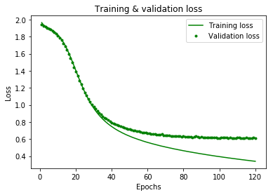
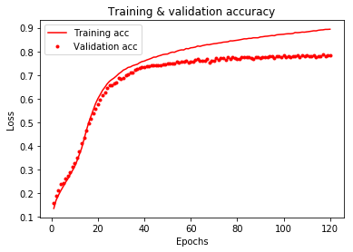
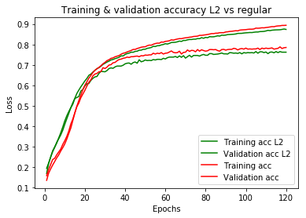
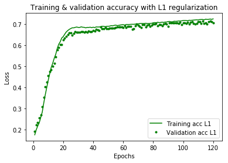

# Regularization and Optimization Lab

## Objective

In this lab, we'll gain experience detecting and dealing with a ANN model that is overfitting using various regularization and hyperparameter tuning techniques!

## Getting Started

In this lab, we'll work with a large dataset of customer complaints to a bank, with the goal of predicting what product the customer is complaining about based on the text of their complaint.  There are 7 different possible products that we can predict, making this a multi-class classification task. 


#### Preprocessing our Data Set
We'll start by preprocessing our dataset by tokenizing the complaints and limiting the number of words we consider to reduce dimensionality. 

#### Building our Tuning our Model
Once we have preprocessed our data set, we'll build a model and explore the various ways that we can reduce overfitting using the following strategies:
- Early stopping to minimize the discrepancy between train and test accuracy.
- L1 and L2 regularization.
- Dropout regularization.
- Using more data.


**_Let's Get Started!_**

## 2. Preprocessing the Bank Complaints Data Set

### 2.1 Import the libraries and take a sample

Run the cell below to import everything we'll need for this lab. 


```python
import matplotlib.pyplot as plt
import pandas as pd
import numpy as np
from sklearn.model_selection import train_test_split
from keras.utils.np_utils import to_categorical
from sklearn import preprocessing
from keras.preprocessing.text import Tokenizer
import random
random.seed(0)
```

Now, in the cell below, import our data into a DataFrame.  The data is currently stored in `Bank_complaints.csv`.
Then, `.describe()` the dataset to get a feel for what we're working with. 


```python
df = pd.read_csv('Bank_complaints.csv')
df.describe()
```


<div>
<style scoped>
    .dataframe tbody tr th:only-of-type {
        vertical-align: middle;
    }

    .dataframe tbody tr th {
        vertical-align: top;
    }

    .dataframe thead th {
        text-align: right;
    }
</style>
<table border="1" class="dataframe">
  <thead>
    <tr style="text-align: right;">
      <th></th>
      <th>Product</th>
      <th>Consumer complaint narrative</th>
    </tr>
  </thead>
  <tbody>
    <tr>
      <th>count</th>
      <td>60000</td>
      <td>60000</td>
    </tr>
    <tr>
      <th>unique</th>
      <td>7</td>
      <td>59724</td>
    </tr>
    <tr>
      <th>top</th>
      <td>Student loan</td>
      <td>I am filing this complaint because Experian ha...</td>
    </tr>
    <tr>
      <th>freq</th>
      <td>11404</td>
      <td>26</td>
    </tr>
  </tbody>
</table>
</div>


In order to speed things up during the development process (and also to give us the ability to see how adding more data affects our model performance), we're going to work with a sample of our dataset rather than the whole thing.  The entire dataset consists of 60,000 rows--we're going to build a model using only 10,000 items randomly sampled from this.

In the cell below:

* Get a random sample of `10000` items from our dataset (HINT: use the `df` object's `.sample()` method to make this easy)
* Reset the indexes on these samples to `range(10000)`, so that the indices for our rows are sequential and make sense.
* Store our labels, which are found in `"Product"`, in a different variable.
* Store the data, found in `"Consumer complaint narrative`, in the variable `complaints`.


```python
df = df.sample(10000)
df.index = range(10000)
product = df["Product"]
complaints = df["Consumer complaint narrative"]
```

### 2.2 Tokenizing the Complaints

We'll only keep 2,000 most common words and use one-hot encoding to quickly vectorize our dataset from text into a format that a neural network can work with. 

In the cell below:

* Create a `Tokenizer()` object, and set the `num_words` parameter to `2000`.
* Call the tokenizer object's `fit_on_texts()` method and pass in our `complaints` variable we created above. 


```python
tokenizer = Tokenizer(num_words=2000)
tokenizer.fit_on_texts(complaints)
```

Now, we'll create some text sequences by calling the `tokenizer` object's `.texts_to_sequences()` method and feeding in our `complaints` object.


```python
sequences = tokenizer.texts_to_sequences(complaints)
```

Finally, we'll convert our text data from text to a vectorized matrix.  

In the cell below:

* Call the `tokenizer` object's `.texts_to_matrix` method, passing in our `complaints` variable, as well as setting the `mode` parameter equal to `'binary'`.
* Store the tokenizer's `.word_index` in the appropriate variable.
* Check the `np.shape()` of our `one_hot_results`.


```python
one_hot_results= tokenizer.texts_to_matrix(complaints, mode='binary')
word_index = tokenizer.word_index
np.shape(one_hot_results) # Expected Results (10000, 2000)
```


    (10000, 2000)


### 2.3 One-hot Encoding of the Products Column

Now that we've tokenized and encoded our text data, we still need to one-hot encode our label data.  

In the cell below:


* Create a `LabelEncoder` object, which can found inside the `preprocessing` module.
* `fit` the label encoder we just created to `product`.


```python
le = preprocessing.LabelEncoder()
le.fit(product)
```


    LabelEncoder()


Let's check what classes our label encoder found.  Run the cell below to examine a list of classes that `product` contains.


```python
 list(le.classes_)
```


    ['Bank account or service',
     'Checking or savings account',
     'Consumer Loan',
     'Credit card',
     'Credit reporting',
     'Mortgage',
     'Student loan']


Now, we'll need to transform `product` into a numeric vector.  

In the cell below, use the label encoder's `.transform` method on `product` to create an integer encoded version of our labels. 

Then, access `product_cat` to see an example of how the labels are now encoded. 


```python
product_cat = le.transform(product) 
product_cat
```


    array([6, 4, 4, ..., 5, 2, 5])


Now, we need to go from integer encoding to one-hot encoding.  Use the `to_categorical` method from keras to do this easily in the cell below.


```python
product_onehot = to_categorical(product_cat)
```


```python
product_onehot
```


    array([[ 0.,  0.,  0., ...,  0.,  0.,  1.],
           [ 0.,  0.,  0., ...,  1.,  0.,  0.],
           [ 0.,  0.,  0., ...,  1.,  0.,  0.],
           ..., 
           [ 0.,  0.,  0., ...,  0.,  1.,  0.],
           [ 0.,  0.,  1., ...,  0.,  0.,  0.],
           [ 0.,  0.,  0., ...,  0.,  1.,  0.]])


Finally, let's check the shape of our one-hot encoded labels to make sure everything worked correctly.


```python
np.shape(product_onehot) # Expected Output: (10000, 7)
```


    (10000, 7)


### 2.4 Train - test split

Now, we'll split our data into training and testing sets.  


We'll accomplish this by generating a random list of 1500 different indices between 1 and 10000.  Then, we'll slice these rows and store them as our test set, and delete them from the training set (it's very important to remember to remove them from the training set!)

Run the cell below to create a set of random indices for our test set. 


```python
test_index = random.sample(range(1,10000), 1500)
```

Now:

* Slice the `test_index` rows from `one_hot_results` and store them in `test`.


```python
test = one_hot_results[test_index]

# This line returns a version of our one_hot_results that has every item with an index in test_index removed
train = np.delete(one_hot_results, test_index, 0)
```

Now, we'll need to repeat the splitting process on our labels, making sure that we use the same indices we used to split our data. 

In the cell below:

* Slice `test_index` from `product_onehot`
* Use `np.delete` to remove `test_index` items from `product_onehot` (the syntax is exactly the same above)


```python
label_test = product_onehot[test_index]
label_train = np.delete(product_onehot, test_index, 0)
```

Now, let's examine the shape everything we just did to make sure that the dimensions match up.  

In the cell below, use `np.shape` to check the shape of:

* `label_test`
* `label_train`
* `test`
* `train`


```python
print(np.shape(label_test)) # Expected Output: (1500, 7)
print(np.shape(label_train)) # Expected Output: (8500, 7)
print(np.shape(test)) # Expected Output: (1500, 2000)
print(np.shape(train)) # Expected Output: (8500, 2000)
```

    (1500, 7)
    (8500, 7)
    (1500, 2000)
    (8500, 2000)


## 3. Running the model using a validation set.

### 3.1 Creating the validation set

In the lecture we mentioned that in deep learning, we generally keep aside a validation set, which is used during hyperparameter tuning. Then when we have made the final model decision, the test set is used to define the final model perforance. 

In this example, let's take the first 1000 cases out of the training set to become the validation set. You should do this for both `train` and `label_train`.

Run the cell below to create our validation set. 


```python
random.seed(123)
val = train[:1000]
train_final = train[1000:]
label_val = label_train[:1000]
label_train_final = label_train[1000:]
```

### 3.2 Creating, compiling and running the model

Let's rebuild a fully connected (Dense) layer network with relu activations in Keras.

Recall that we used 2 hidden with 50 units in the first layer and 25 in the second, both with a `relu` activation function. Because we are dealing with a multiclass problem (classifying the complaints into 7 classes), we use a use a softmax classifyer in order to output 7 class probabilities per case.

In the cell below:

* Import `Sequential` from the appropriate module in keras.
* Import `Dense` from the appropriate module in keras.


```python
from keras.models import Sequential
from keras.layers import Dense
```

Now, build a model with the following specifications in the cell below:

* An input layer of shape `(2000,)`
* Hidden layer 1: Dense, 50 neurons, relu activation 
* Hidden layer 2: Dense, 25 neurons, relu activation
* Output layer: Dense, 7 neurons, softmax activation


```python
model = Sequential()
model.add(Dense(50, activation='relu', input_shape=(2000,))) #2 hidden layers
model.add(Dense(25, activation='relu'))
model.add(Dense(7, activation='softmax'))
```

In the cell below, `compile` the model with the following settings:

* Optimizer is `"SGD"`
* Loss is `'categorical_crossentropy'`
* metrics is `['accuracy']`


```python
model.compile(optimizer='SGD',
              loss='categorical_crossentropy',
              metrics=['accuracy'])
```

Now, Train the model for 120 epochs in mini-batches of 256 samples. Also pass in `(val, label_val)` to the `validation_data` parameter, so that we see how our model does on the test set after every epoch. 


```python
model_val = model.fit(train_final,
                    label_train_final,
                    epochs=120,
                    batch_size=256,
                    validation_data=(val, label_val))
```

    Train on 7500 samples, validate on 1000 samples
    Epoch 1/120
    7500/7500 [==============================] - 0s 36us/step - loss: 1.9645 - acc: 0.1343 - val_loss: 1.9444 - val_acc: 0.1570
    Epoch 2/120
    7500/7500 [==============================] - 0s 26us/step - loss: 1.9377 - acc: 0.1693 - val_loss: 1.9272 - val_acc: 0.1870
    Epoch 3/120
    7500/7500 [==============================] - 0s 27us/step - loss: 1.9227 - acc: 0.1903 - val_loss: 1.9152 - val_acc: 0.2120
    Epoch 4/120
    7500/7500 [==============================] - 0s 25us/step - loss: 1.9109 - acc: 0.2092 - val_loss: 1.9046 - val_acc: 0.2360
    Epoch 5/120
    7500/7500 [==============================] - 0s 25us/step - loss: 1.8994 - acc: 0.2263 - val_loss: 1.8940 - val_acc: 0.2420
    Epoch 6/120
    7500/7500 [==============================] - 0s 27us/step - loss: 1.8874 - acc: 0.2441 - val_loss: 1.8820 - val_acc: 0.2590
    Epoch 7/120
    7500/7500 [==============================] - 0s 25us/step - loss: 1.8741 - acc: 0.2587 - val_loss: 1.8684 - val_acc: 0.2730
    Epoch 8/120
    7500/7500 [==============================] - 0s 25us/step - loss: 1.8587 - acc: 0.2777 - val_loss: 1.8526 - val_acc: 0.2870
    Epoch 9/120
    7500/7500 [==============================] - 0s 26us/step - loss: 1.8410 - acc: 0.2939 - val_loss: 1.8339 - val_acc: 0.3100
    Epoch 10/120
    7500/7500 [==============================] - 0s 30us/step - loss: 1.8202 - acc: 0.3123 - val_loss: 1.8125 - val_acc: 0.3280
    Epoch 11/120
    7500/7500 [==============================] - 0s 27us/step - loss: 1.7963 - acc: 0.3359 - val_loss: 1.7873 - val_acc: 0.3490
    Epoch 12/120
    7500/7500 [==============================] - 0s 24us/step - loss: 1.7683 - acc: 0.3631 - val_loss: 1.7577 - val_acc: 0.3750
    Epoch 13/120
    7500/7500 [==============================] - 0s 25us/step - loss: 1.7361 - acc: 0.3897 - val_loss: 1.7236 - val_acc: 0.4100
    Epoch 14/120
    7500/7500 [==============================] - 0s 26us/step - loss: 1.6990 - acc: 0.4267 - val_loss: 1.6855 - val_acc: 0.4340
    Epoch 15/120
    7500/7500 [==============================] - 0s 25us/step - loss: 1.6577 - acc: 0.4636 - val_loss: 1.6421 - val_acc: 0.4650
    Epoch 16/120
    7500/7500 [==============================] - 0s 29us/step - loss: 1.6122 - acc: 0.4969 - val_loss: 1.5955 - val_acc: 0.4950
    Epoch 17/120
    7500/7500 [==============================] - 0s 28us/step - loss: 1.5633 - acc: 0.5251 - val_loss: 1.5466 - val_acc: 0.5130
    Epoch 18/120
    7500/7500 [==============================] - 0s 24us/step - loss: 1.5117 - acc: 0.5519 - val_loss: 1.4969 - val_acc: 0.5390
    Epoch 19/120
    7500/7500 [==============================] - 0s 25us/step - loss: 1.4581 - acc: 0.5788 - val_loss: 1.4428 - val_acc: 0.5570
    Epoch 20/120
    7500/7500 [==============================] - 0s 25us/step - loss: 1.4040 - acc: 0.5999 - val_loss: 1.3900 - val_acc: 0.5750
    Epoch 21/120
    7500/7500 [==============================] - 0s 27us/step - loss: 1.3500 - acc: 0.6169 - val_loss: 1.3382 - val_acc: 0.5960
    Epoch 22/120
    7500/7500 [==============================] - 0s 27us/step - loss: 1.2972 - acc: 0.6348 - val_loss: 1.2872 - val_acc: 0.6150
    Epoch 23/120
    7500/7500 [==============================] - 0s 30us/step - loss: 1.2455 - acc: 0.6480 - val_loss: 1.2404 - val_acc: 0.6270
    Epoch 24/120
    7500/7500 [==============================] - 0s 32us/step - loss: 1.1962 - acc: 0.6623 - val_loss: 1.1923 - val_acc: 0.6460
    Epoch 25/120
    7500/7500 [==============================] - 0s 29us/step - loss: 1.1496 - acc: 0.6733 - val_loss: 1.1483 - val_acc: 0.6550
    Epoch 26/120
    7500/7500 [==============================] - 0s 26us/step - loss: 1.1063 - acc: 0.6807 - val_loss: 1.1091 - val_acc: 0.6580
    Epoch 27/120
    7500/7500 [==============================] - 0s 28us/step - loss: 1.0655 - acc: 0.6875 - val_loss: 1.0740 - val_acc: 0.6660
    Epoch 28/120
    7500/7500 [==============================] - 0s 29us/step - loss: 1.0281 - acc: 0.6959 - val_loss: 1.0403 - val_acc: 0.6670
    Epoch 29/120
    7500/7500 [==============================] - 0s 28us/step - loss: 0.9933 - acc: 0.7053 - val_loss: 1.0066 - val_acc: 0.6860
    Epoch 30/120
    7500/7500 [==============================] - 0s 31us/step - loss: 0.9611 - acc: 0.7121 - val_loss: 0.9799 - val_acc: 0.6820
    Epoch 31/120
    7500/7500 [==============================] - 0s 32us/step - loss: 0.9314 - acc: 0.7209 - val_loss: 0.9537 - val_acc: 0.6890
    Epoch 32/120
    7500/7500 [==============================] - 0s 32us/step - loss: 0.9039 - acc: 0.7251 - val_loss: 0.9289 - val_acc: 0.6990
    Epoch 33/120
    7500/7500 [==============================] - 0s 27us/step - loss: 0.8788 - acc: 0.7319 - val_loss: 0.9097 - val_acc: 0.7010
    Epoch 34/120
    7500/7500 [==============================] - 0s 26us/step - loss: 0.8552 - acc: 0.7340 - val_loss: 0.8869 - val_acc: 0.7100
    Epoch 35/120
    7500/7500 [==============================] - 0s 29us/step - loss: 0.8338 - acc: 0.7395 - val_loss: 0.8684 - val_acc: 0.7120
    Epoch 36/120
    7500/7500 [==============================] - 0s 28us/step - loss: 0.8138 - acc: 0.7425 - val_loss: 0.8517 - val_acc: 0.7200
    Epoch 37/120
    7500/7500 [==============================] - 0s 25us/step - loss: 0.7950 - acc: 0.7455 - val_loss: 0.8387 - val_acc: 0.7260
    Epoch 38/120
    7500/7500 [==============================] - 0s 25us/step - loss: 0.7777 - acc: 0.7520 - val_loss: 0.8216 - val_acc: 0.7280
    Epoch 39/120
    7500/7500 [==============================] - 0s 23us/step - loss: 0.7614 - acc: 0.7567 - val_loss: 0.8089 - val_acc: 0.7320
    Epoch 40/120
    7500/7500 [==============================] - 0s 23us/step - loss: 0.7463 - acc: 0.7589 - val_loss: 0.7945 - val_acc: 0.7340
    Epoch 41/120
    7500/7500 [==============================] - 0s 23us/step - loss: 0.7318 - acc: 0.7633 - val_loss: 0.7858 - val_acc: 0.7380
    Epoch 42/120
    7500/7500 [==============================] - 0s 24us/step - loss: 0.7180 - acc: 0.7668 - val_loss: 0.7740 - val_acc: 0.7360
    Epoch 43/120
    7500/7500 [==============================] - 0s 23us/step - loss: 0.7056 - acc: 0.7705 - val_loss: 0.7663 - val_acc: 0.7400
    Epoch 44/120
    7500/7500 [==============================] - 0s 23us/step - loss: 0.6934 - acc: 0.7755 - val_loss: 0.7594 - val_acc: 0.7400
    Epoch 45/120
    7500/7500 [==============================] - 0s 23us/step - loss: 0.6827 - acc: 0.7757 - val_loss: 0.7475 - val_acc: 0.7420
    Epoch 46/120
    7500/7500 [==============================] - 0s 24us/step - loss: 0.6712 - acc: 0.7801 - val_loss: 0.7375 - val_acc: 0.7430
    Epoch 47/120
    7500/7500 [==============================] - 0s 28us/step - loss: 0.6612 - acc: 0.7829 - val_loss: 0.7326 - val_acc: 0.7400
    Epoch 48/120
    7500/7500 [==============================] - 0s 27us/step - loss: 0.6511 - acc: 0.7864 - val_loss: 0.7284 - val_acc: 0.7450
    Epoch 49/120
    7500/7500 [==============================] - 0s 24us/step - loss: 0.6421 - acc: 0.7880 - val_loss: 0.7181 - val_acc: 0.7440
    Epoch 50/120
    7500/7500 [==============================] - 0s 25us/step - loss: 0.6333 - acc: 0.7887 - val_loss: 0.7143 - val_acc: 0.7480
    Epoch 51/120
    7500/7500 [==============================] - 0s 25us/step - loss: 0.6245 - acc: 0.7937 - val_loss: 0.7071 - val_acc: 0.7470
    Epoch 52/120
    7500/7500 [==============================] - 0s 24us/step - loss: 0.6164 - acc: 0.7968 - val_loss: 0.7025 - val_acc: 0.7490
    Epoch 53/120
    7500/7500 [==============================] - 0s 27us/step - loss: 0.6086 - acc: 0.7963 - val_loss: 0.6970 - val_acc: 0.7490
    Epoch 54/120
    7500/7500 [==============================] - 0s 30us/step - loss: 0.6013 - acc: 0.8009 - val_loss: 0.6912 - val_acc: 0.7570
    Epoch 55/120
    7500/7500 [==============================] - 0s 26us/step - loss: 0.5936 - acc: 0.8043 - val_loss: 0.6905 - val_acc: 0.7530
    Epoch 56/120
    7500/7500 [==============================] - 0s 25us/step - loss: 0.5873 - acc: 0.8064 - val_loss: 0.6839 - val_acc: 0.7570
    Epoch 57/120
    7500/7500 [==============================] - 0s 26us/step - loss: 0.5796 - acc: 0.8061 - val_loss: 0.6785 - val_acc: 0.7550
    Epoch 58/120
    7500/7500 [==============================] - 0s 29us/step - loss: 0.5729 - acc: 0.8119 - val_loss: 0.6762 - val_acc: 0.7600
    Epoch 59/120
    7500/7500 [==============================] - 0s 32us/step - loss: 0.5665 - acc: 0.8111 - val_loss: 0.6723 - val_acc: 0.7530
    Epoch 60/120
    7500/7500 [==============================] - 0s 27us/step - loss: 0.5602 - acc: 0.8151 - val_loss: 0.6712 - val_acc: 0.7570
    Epoch 61/120
    7500/7500 [==============================] - 0s 27us/step - loss: 0.5546 - acc: 0.8161 - val_loss: 0.6684 - val_acc: 0.7580
    Epoch 62/120
    7500/7500 [==============================] - 0s 31us/step - loss: 0.5485 - acc: 0.8181 - val_loss: 0.6624 - val_acc: 0.7630
    Epoch 63/120
    7500/7500 [==============================] - 0s 27us/step - loss: 0.5428 - acc: 0.8227 - val_loss: 0.6627 - val_acc: 0.7680
    Epoch 64/120
    7500/7500 [==============================] - 0s 29us/step - loss: 0.5376 - acc: 0.8212 - val_loss: 0.6583 - val_acc: 0.7610
    Epoch 65/120
    7500/7500 [==============================] - 0s 31us/step - loss: 0.5320 - acc: 0.8243 - val_loss: 0.6541 - val_acc: 0.7590
    Epoch 66/120
    7500/7500 [==============================] - 0s 27us/step - loss: 0.5265 - acc: 0.8265 - val_loss: 0.6519 - val_acc: 0.7600
    Epoch 67/120
    7500/7500 [==============================] - 0s 27us/step - loss: 0.5209 - acc: 0.8285 - val_loss: 0.6505 - val_acc: 0.7670
    Epoch 68/120
    7500/7500 [==============================] - 0s 27us/step - loss: 0.5159 - acc: 0.8283 - val_loss: 0.6555 - val_acc: 0.7530
    Epoch 69/120
    7500/7500 [==============================] - 0s 27us/step - loss: 0.5117 - acc: 0.8308 - val_loss: 0.6446 - val_acc: 0.7610
    Epoch 70/120
    7500/7500 [==============================] - 0s 28us/step - loss: 0.5065 - acc: 0.8325 - val_loss: 0.6455 - val_acc: 0.7620
    Epoch 71/120
    7500/7500 [==============================] - 0s 31us/step - loss: 0.5019 - acc: 0.8335 - val_loss: 0.6426 - val_acc: 0.7730
    Epoch 72/120
    7500/7500 [==============================] - 0s 26us/step - loss: 0.4972 - acc: 0.8355 - val_loss: 0.6388 - val_acc: 0.7660
    Epoch 73/120
    7500/7500 [==============================] - 0s 27us/step - loss: 0.4927 - acc: 0.8364 - val_loss: 0.6386 - val_acc: 0.7710
    Epoch 74/120
    7500/7500 [==============================] - 0s 27us/step - loss: 0.4882 - acc: 0.8391 - val_loss: 0.6369 - val_acc: 0.7700
    Epoch 75/120
    7500/7500 [==============================] - 0s 29us/step - loss: 0.4834 - acc: 0.8397 - val_loss: 0.6380 - val_acc: 0.7640
    Epoch 76/120
    7500/7500 [==============================] - 0s 26us/step - loss: 0.4798 - acc: 0.8407 - val_loss: 0.6344 - val_acc: 0.7750
    Epoch 77/120
    7500/7500 [==============================] - 0s 27us/step - loss: 0.4751 - acc: 0.8445 - val_loss: 0.6332 - val_acc: 0.7670
    Epoch 78/120
    7500/7500 [==============================] - 0s 29us/step - loss: 0.4712 - acc: 0.8444 - val_loss: 0.6320 - val_acc: 0.7740
    Epoch 79/120
    7500/7500 [==============================] - 0s 31us/step - loss: 0.4669 - acc: 0.8459 - val_loss: 0.6289 - val_acc: 0.7700
    Epoch 80/120
    7500/7500 [==============================] - 0s 30us/step - loss: 0.4629 - acc: 0.8472 - val_loss: 0.6305 - val_acc: 0.7670
    Epoch 81/120
    7500/7500 [==============================] - 0s 31us/step - loss: 0.4590 - acc: 0.8488 - val_loss: 0.6276 - val_acc: 0.7690
    Epoch 82/120
    7500/7500 [==============================] - 0s 31us/step - loss: 0.4548 - acc: 0.8508 - val_loss: 0.6274 - val_acc: 0.7750
    Epoch 83/120
    7500/7500 [==============================] - 0s 34us/step - loss: 0.4511 - acc: 0.8532 - val_loss: 0.6291 - val_acc: 0.7750
    Epoch 84/120
    7500/7500 [==============================] - 0s 34us/step - loss: 0.4477 - acc: 0.8531 - val_loss: 0.6246 - val_acc: 0.7740
    Epoch 85/120
    7500/7500 [==============================] - 0s 31us/step - loss: 0.4440 - acc: 0.8551 - val_loss: 0.6218 - val_acc: 0.7750
    Epoch 86/120
    7500/7500 [==============================] - 0s 27us/step - loss: 0.4402 - acc: 0.8552 - val_loss: 0.6265 - val_acc: 0.7700
    Epoch 87/120
    7500/7500 [==============================] - 0s 35us/step - loss: 0.4368 - acc: 0.8576 - val_loss: 0.6310 - val_acc: 0.7670
    Epoch 88/120
    7500/7500 [==============================] - 0s 33us/step - loss: 0.4332 - acc: 0.8576 - val_loss: 0.6252 - val_acc: 0.7750
    Epoch 89/120
    7500/7500 [==============================] - 0s 28us/step - loss: 0.4293 - acc: 0.8576 - val_loss: 0.6185 - val_acc: 0.7760
    Epoch 90/120
    7500/7500 [==============================] - 0s 28us/step - loss: 0.4260 - acc: 0.8611 - val_loss: 0.6279 - val_acc: 0.7720
    Epoch 91/120
    7500/7500 [==============================] - 0s 35us/step - loss: 0.4227 - acc: 0.8620 - val_loss: 0.6165 - val_acc: 0.7750
    Epoch 92/120
    7500/7500 [==============================] - 0s 34us/step - loss: 0.4193 - acc: 0.8637 - val_loss: 0.6191 - val_acc: 0.7760
    Epoch 93/120
    7500/7500 [==============================] - 0s 27us/step - loss: 0.4157 - acc: 0.8644 - val_loss: 0.6165 - val_acc: 0.7760
    Epoch 94/120
    7500/7500 [==============================] - 0s 30us/step - loss: 0.4126 - acc: 0.8659 - val_loss: 0.6161 - val_acc: 0.7810
    Epoch 95/120
    7500/7500 [==============================] - 0s 27us/step - loss: 0.4095 - acc: 0.8672 - val_loss: 0.6171 - val_acc: 0.7790
    Epoch 96/120
    7500/7500 [==============================] - 0s 27us/step - loss: 0.4061 - acc: 0.8665 - val_loss: 0.6165 - val_acc: 0.7730
    Epoch 97/120
    7500/7500 [==============================] - 0s 28us/step - loss: 0.4029 - acc: 0.8701 - val_loss: 0.6142 - val_acc: 0.7780
    Epoch 98/120
    7500/7500 [==============================] - 0s 27us/step - loss: 0.3997 - acc: 0.8712 - val_loss: 0.6153 - val_acc: 0.7800
    Epoch 99/120
    7500/7500 [==============================] - 0s 28us/step - loss: 0.3966 - acc: 0.8719 - val_loss: 0.6137 - val_acc: 0.7770
    Epoch 100/120
    7500/7500 [==============================] - 0s 28us/step - loss: 0.3938 - acc: 0.8725 - val_loss: 0.6133 - val_acc: 0.7820
    Epoch 101/120
    7500/7500 [==============================] - 0s 26us/step - loss: 0.3910 - acc: 0.8740 - val_loss: 0.6158 - val_acc: 0.7770
    Epoch 102/120
    7500/7500 [==============================] - 0s 28us/step - loss: 0.3876 - acc: 0.8748 - val_loss: 0.6152 - val_acc: 0.7780
    Epoch 103/120
    7500/7500 [==============================] - 0s 30us/step - loss: 0.3847 - acc: 0.8747 - val_loss: 0.6164 - val_acc: 0.7770
    Epoch 104/120
    7500/7500 [==============================] - 0s 27us/step - loss: 0.3822 - acc: 0.8759 - val_loss: 0.6144 - val_acc: 0.7780
    Epoch 105/120
    7500/7500 [==============================] - 0s 27us/step - loss: 0.3787 - acc: 0.8800 - val_loss: 0.6116 - val_acc: 0.7780
    Epoch 106/120
    7500/7500 [==============================] - 0s 27us/step - loss: 0.3764 - acc: 0.8793 - val_loss: 0.6144 - val_acc: 0.7820
    Epoch 107/120
    7500/7500 [==============================] - 0s 27us/step - loss: 0.3732 - acc: 0.8801 - val_loss: 0.6118 - val_acc: 0.7750
    Epoch 108/120
    7500/7500 [==============================] - 0s 27us/step - loss: 0.3704 - acc: 0.8817 - val_loss: 0.6132 - val_acc: 0.7820
    Epoch 109/120
    7500/7500 [==============================] - 0s 26us/step - loss: 0.3680 - acc: 0.8813 - val_loss: 0.6122 - val_acc: 0.7790
    Epoch 110/120
    7500/7500 [==============================] - 0s 26us/step - loss: 0.3650 - acc: 0.8828 - val_loss: 0.6146 - val_acc: 0.7820
    Epoch 111/120
    7500/7500 [==============================] - 0s 27us/step - loss: 0.3626 - acc: 0.8840 - val_loss: 0.6143 - val_acc: 0.7800
    Epoch 112/120
    7500/7500 [==============================] - 0s 27us/step - loss: 0.3595 - acc: 0.8856 - val_loss: 0.6136 - val_acc: 0.7810
    Epoch 113/120
    7500/7500 [==============================] - 0s 27us/step - loss: 0.3571 - acc: 0.8873 - val_loss: 0.6124 - val_acc: 0.7830
    Epoch 114/120
    7500/7500 [==============================] - 0s 28us/step - loss: 0.3546 - acc: 0.8869 - val_loss: 0.6126 - val_acc: 0.7770
    Epoch 115/120
    7500/7500 [==============================] - 0s 28us/step - loss: 0.3516 - acc: 0.8895 - val_loss: 0.6152 - val_acc: 0.7790
    Epoch 116/120
    7500/7500 [==============================] - 0s 28us/step - loss: 0.3495 - acc: 0.8908 - val_loss: 0.6122 - val_acc: 0.7810
    Epoch 117/120
    7500/7500 [==============================] - 0s 28us/step - loss: 0.3465 - acc: 0.8913 - val_loss: 0.6125 - val_acc: 0.7880
    Epoch 118/120
    7500/7500 [==============================] - 0s 27us/step - loss: 0.3439 - acc: 0.8932 - val_loss: 0.6128 - val_acc: 0.7800
    Epoch 119/120
    7500/7500 [==============================] - 0s 26us/step - loss: 0.3416 - acc: 0.8932 - val_loss: 0.6152 - val_acc: 0.7840
    Epoch 120/120
    7500/7500 [==============================] - 0s 26us/step - loss: 0.3393 - acc: 0.8939 - val_loss: 0.6119 - val_acc: 0.7850


The dictionary `history` contains four entries this time: one per metric that was being monitored during training and during validation.

In the cell below:

* Store the model's `.history` inside of `model_val_dict`
* Check what `keys()` this dictionary contains


```python
model_val_dict = model_val.history
model_val_dict.keys()
```


    dict_keys(['val_loss', 'val_acc', 'loss', 'acc'])


Now, let's get the final results on the training and testing sets using `model.evaluate()` on `train_final` and `label_train_final`.


```python
results_train = model.evaluate(train_final, label_train_final)
```

    7500/7500 [==============================] - 0s 42us/step


Let's also use this function to get the results on our testing set.  Call the function again, but this time on `test` and `label_test`. 


```python
results_test = model.evaluate(test, label_test)
```

    1500/1500 [==============================] - 0s 38us/step


Now, check the contents of each. 


```python
results_train # Expected Results: [0.33576024494171142, 0.89600000000000002]
```


    [0.33576024494171142, 0.89600000000000002]


```python
results_test # Expected Results: [0.72006658554077152, 0.74333333365122478]
```


    [0.72006658554077152, 0.74333333365122478]


### Plotting the results

Let's plot the results. Let's include the training and the validation loss in the same plot. We'll do the same thing for the training and validation accuracy.

Run the cell below to visualize a plot of our training and validation loss.


```python
plt.clf()

import matplotlib.pyplot as plt
loss_values = model_val_dict['loss']
val_loss_values = model_val_dict['val_loss']

epochs = range(1, len(loss_values) + 1)
plt.plot(epochs, loss_values, 'g', label='Training loss')
plt.plot(epochs, val_loss_values, 'g.', label='Validation loss')

plt.title('Training & validation loss')
plt.xlabel('Epochs')
plt.ylabel('Loss')
plt.legend()
plt.show()
```





Interesting! 

Run the cell below to visualize a plot of our training and validation accuracy>


```python
plt.clf()

acc_values = model_val_dict['acc'] 
val_acc_values = model_val_dict['val_acc']

plt.plot(epochs, acc_values, 'r', label='Training acc')
plt.plot(epochs, val_acc_values, 'r.', label='Validation acc')
plt.title('Training & validation accuracy')
plt.xlabel('Epochs')
plt.ylabel('Loss')
plt.legend()
plt.show()
```





We observe an interesting pattern here: although the training accuracy keeps increasing when going through more epochs, and the training loss keeps decreasing, the validation accuracy and loss seem to be reaching a status quo around the 60th epoch. This means that we're actually **overfitting** to the train data when we do as many epochs as we were doing. Luckily, you learned how to tackle overfitting in the previous lecture! For starters, it does seem clear that we are training too long. So let's stop training at the 60th epoch first (so-called "early stopping") before we move to more advanced regularization techniques!

## 3. Early stopping

Now that we know that the model starts to overfit around epoch 60, we can just retrain the model from scratch, but this time only up to 60 epochs! This will help us with our overfitting problem.  This method is called **_Early Stopping_**.

In the cell below: 

* Recreate the exact model we did above. 
* Compile the model with the exact same hyperparameters.
* Fit the model with the exact same hyperparameters, with the exception of `epochs`.  This time, set epochs to `60` instead of `120`.


```python
model = Sequential()
model.add(Dense(50, activation='relu', input_shape=(2000,))) #2 hidden layers
model.add(Dense(25, activation='relu'))
model.add(Dense(7, activation='softmax'))

model.compile(optimizer='SGD',
              loss='categorical_crossentropy',
              metrics=['accuracy'])

final_model = model.fit(train_final,
                    label_train_final,
                    epochs=60,
                    batch_size=256,
                    validation_data=(val, label_val))
```

    Train on 7500 samples, validate on 1000 samples
    Epoch 1/60
    7500/7500 [==============================] - 0s 34us/step - loss: 1.9474 - acc: 0.1571 - val_loss: 1.9435 - val_acc: 0.1520
    Epoch 2/60
    7500/7500 [==============================] - 0s 29us/step - loss: 1.9276 - acc: 0.1855 - val_loss: 1.9287 - val_acc: 0.1740
    Epoch 3/60
    7500/7500 [==============================] - 0s 29us/step - loss: 1.9151 - acc: 0.2003 - val_loss: 1.9178 - val_acc: 0.1900
    Epoch 4/60
    7500/7500 [==============================] - 0s 28us/step - loss: 1.9042 - acc: 0.2157 - val_loss: 1.9082 - val_acc: 0.2110
    Epoch 5/60
    7500/7500 [==============================] - 0s 29us/step - loss: 1.8935 - acc: 0.2276 - val_loss: 1.8985 - val_acc: 0.2100
    Epoch 6/60
    7500/7500 [==============================] - 0s 32us/step - loss: 1.8820 - acc: 0.2324 - val_loss: 1.8879 - val_acc: 0.2190
    Epoch 7/60
    7500/7500 [==============================] - 0s 31us/step - loss: 1.8692 - acc: 0.2432 - val_loss: 1.8753 - val_acc: 0.2330
    Epoch 8/60
    7500/7500 [==============================] - 0s 28us/step - loss: 1.8545 - acc: 0.2583 - val_loss: 1.8607 - val_acc: 0.2420
    Epoch 9/60
    7500/7500 [==============================] - 0s 27us/step - loss: 1.8370 - acc: 0.2779 - val_loss: 1.8427 - val_acc: 0.2600
    Epoch 10/60
    7500/7500 [==============================] - 0s 27us/step - loss: 1.8157 - acc: 0.2988 - val_loss: 1.8211 - val_acc: 0.2800
    Epoch 11/60
    7500/7500 [==============================] - 0s 26us/step - loss: 1.7902 - acc: 0.3256 - val_loss: 1.7941 - val_acc: 0.2970
    Epoch 12/60
    7500/7500 [==============================] - 0s 28us/step - loss: 1.7597 - acc: 0.3467 - val_loss: 1.7621 - val_acc: 0.3160
    Epoch 13/60
    7500/7500 [==============================] - 0s 29us/step - loss: 1.7252 - acc: 0.3693 - val_loss: 1.7272 - val_acc: 0.3430
    Epoch 14/60
    7500/7500 [==============================] - 0s 26us/step - loss: 1.6870 - acc: 0.3891 - val_loss: 1.6876 - val_acc: 0.3860
    Epoch 15/60
    7500/7500 [==============================] - 0s 27us/step - loss: 1.6449 - acc: 0.4115 - val_loss: 1.6456 - val_acc: 0.4110
    Epoch 16/60
    7500/7500 [==============================] - 0s 27us/step - loss: 1.6002 - acc: 0.4411 - val_loss: 1.6004 - val_acc: 0.4350
    Epoch 17/60
    7500/7500 [==============================] - 0s 27us/step - loss: 1.5528 - acc: 0.4664 - val_loss: 1.5536 - val_acc: 0.4580
    Epoch 18/60
    7500/7500 [==============================] - 0s 28us/step - loss: 1.5034 - acc: 0.5005 - val_loss: 1.5058 - val_acc: 0.4810
    Epoch 19/60
    7500/7500 [==============================] - 0s 28us/step - loss: 1.4532 - acc: 0.5309 - val_loss: 1.4577 - val_acc: 0.5000
    Epoch 20/60
    7500/7500 [==============================] - 0s 29us/step - loss: 1.4030 - acc: 0.5643 - val_loss: 1.4104 - val_acc: 0.5270
    Epoch 21/60
    7500/7500 [==============================] - 0s 30us/step - loss: 1.3531 - acc: 0.5813 - val_loss: 1.3617 - val_acc: 0.5490
    Epoch 22/60
    7500/7500 [==============================] - 0s 27us/step - loss: 1.3030 - acc: 0.6000 - val_loss: 1.3143 - val_acc: 0.5760
    Epoch 23/60
    7500/7500 [==============================] - 0s 27us/step - loss: 1.2545 - acc: 0.6184 - val_loss: 1.2685 - val_acc: 0.5880
    Epoch 24/60
    7500/7500 [==============================] - 0s 26us/step - loss: 1.2084 - acc: 0.6359 - val_loss: 1.2259 - val_acc: 0.6080
    Epoch 25/60
    7500/7500 [==============================] - 0s 27us/step - loss: 1.1644 - acc: 0.6488 - val_loss: 1.1849 - val_acc: 0.6180
    Epoch 26/60
    7500/7500 [==============================] - 0s 28us/step - loss: 1.1232 - acc: 0.6579 - val_loss: 1.1482 - val_acc: 0.6180
    Epoch 27/60
    7500/7500 [==============================] - 0s 28us/step - loss: 1.0848 - acc: 0.6679 - val_loss: 1.1123 - val_acc: 0.6380
    Epoch 28/60
    7500/7500 [==============================] - 0s 27us/step - loss: 1.0491 - acc: 0.6779 - val_loss: 1.0802 - val_acc: 0.6410
    Epoch 29/60
    7500/7500 [==============================] - 0s 28us/step - loss: 1.0157 - acc: 0.6860 - val_loss: 1.0511 - val_acc: 0.6500
    Epoch 30/60
    7500/7500 [==============================] - 0s 30us/step - loss: 0.9847 - acc: 0.6944 - val_loss: 1.0248 - val_acc: 0.6460
    Epoch 31/60
    7500/7500 [==============================] - 0s 31us/step - loss: 0.9563 - acc: 0.6968 - val_loss: 0.9986 - val_acc: 0.6610
    Epoch 32/60
    7500/7500 [==============================] - 0s 29us/step - loss: 0.9298 - acc: 0.7023 - val_loss: 0.9766 - val_acc: 0.6630
    Epoch 33/60
    7500/7500 [==============================] - 0s 26us/step - loss: 0.9051 - acc: 0.7107 - val_loss: 0.9544 - val_acc: 0.6650
    Epoch 34/60
    7500/7500 [==============================] - 0s 27us/step - loss: 0.8822 - acc: 0.7156 - val_loss: 0.9364 - val_acc: 0.6730
    Epoch 35/60
    7500/7500 [==============================] - 0s 27us/step - loss: 0.8617 - acc: 0.7184 - val_loss: 0.9160 - val_acc: 0.6810
    Epoch 36/60
    7500/7500 [==============================] - 0s 29us/step - loss: 0.8418 - acc: 0.7257 - val_loss: 0.8994 - val_acc: 0.6830
    Epoch 37/60
    7500/7500 [==============================] - 0s 22us/step - loss: 0.8230 - acc: 0.7293 - val_loss: 0.8870 - val_acc: 0.6820
    Epoch 38/60
    7500/7500 [==============================] - 0s 28us/step - loss: 0.8064 - acc: 0.7321 - val_loss: 0.8689 - val_acc: 0.6820
    Epoch 39/60
    7500/7500 [==============================] - 0s 32us/step - loss: 0.7903 - acc: 0.7356 - val_loss: 0.8580 - val_acc: 0.6970
    Epoch 40/60
    7500/7500 [==============================] - 0s 28us/step - loss: 0.7754 - acc: 0.7400 - val_loss: 0.8441 - val_acc: 0.6970
    Epoch 41/60
    7500/7500 [==============================] - 0s 26us/step - loss: 0.7612 - acc: 0.7420 - val_loss: 0.8332 - val_acc: 0.6960
    Epoch 42/60
    7500/7500 [==============================] - 0s 26us/step - loss: 0.7479 - acc: 0.7476 - val_loss: 0.8246 - val_acc: 0.6960
    Epoch 43/60
    7500/7500 [==============================] - 0s 29us/step - loss: 0.7353 - acc: 0.7528 - val_loss: 0.8160 - val_acc: 0.6970
    Epoch 44/60
    7500/7500 [==============================] - 0s 29us/step - loss: 0.7238 - acc: 0.7540 - val_loss: 0.8040 - val_acc: 0.6990
    Epoch 45/60
    7500/7500 [==============================] - 0s 29us/step - loss: 0.7125 - acc: 0.7568 - val_loss: 0.7961 - val_acc: 0.6980
    Epoch 46/60
    7500/7500 [==============================] - 0s 28us/step - loss: 0.7016 - acc: 0.7597 - val_loss: 0.7880 - val_acc: 0.7120
    Epoch 47/60
    7500/7500 [==============================] - 0s 27us/step - loss: 0.6914 - acc: 0.7628 - val_loss: 0.7814 - val_acc: 0.7100
    Epoch 48/60
    7500/7500 [==============================] - 0s 28us/step - loss: 0.6822 - acc: 0.7655 - val_loss: 0.7753 - val_acc: 0.7090
    Epoch 49/60
    7500/7500 [==============================] - 0s 26us/step - loss: 0.6732 - acc: 0.7649 - val_loss: 0.7660 - val_acc: 0.7120
    Epoch 50/60
    7500/7500 [==============================] - 0s 25us/step - loss: 0.6639 - acc: 0.7701 - val_loss: 0.7605 - val_acc: 0.7200
    Epoch 51/60
    7500/7500 [==============================] - 0s 26us/step - loss: 0.6556 - acc: 0.7720 - val_loss: 0.7547 - val_acc: 0.7180
    Epoch 52/60
    7500/7500 [==============================] - 0s 31us/step - loss: 0.6474 - acc: 0.7771 - val_loss: 0.7495 - val_acc: 0.7130
    Epoch 53/60
    7500/7500 [==============================] - 0s 34us/step - loss: 0.6391 - acc: 0.7792 - val_loss: 0.7462 - val_acc: 0.7180
    Epoch 54/60
    7500/7500 [==============================] - 0s 29us/step - loss: 0.6321 - acc: 0.7821 - val_loss: 0.7385 - val_acc: 0.7230
    Epoch 55/60
    7500/7500 [==============================] - 0s 25us/step - loss: 0.6245 - acc: 0.7841 - val_loss: 0.7358 - val_acc: 0.7290
    Epoch 56/60
    7500/7500 [==============================] - 0s 25us/step - loss: 0.6178 - acc: 0.7859 - val_loss: 0.7290 - val_acc: 0.7210
    Epoch 57/60
    7500/7500 [==============================] - 0s 25us/step - loss: 0.6108 - acc: 0.7884 - val_loss: 0.7257 - val_acc: 0.7230
    Epoch 58/60
    7500/7500 [==============================] - 0s 27us/step - loss: 0.6039 - acc: 0.7925 - val_loss: 0.7221 - val_acc: 0.7230
    Epoch 59/60
    7500/7500 [==============================] - 0s 27us/step - loss: 0.5975 - acc: 0.7963 - val_loss: 0.7191 - val_acc: 0.7290
    Epoch 60/60
    7500/7500 [==============================] - 0s 26us/step - loss: 0.5920 - acc: 0.7959 - val_loss: 0.7141 - val_acc: 0.7270


Now, as we did before, get our results using `model.evaluate()` on the appropriate variables. 


```python
results_train = model.evaluate(train_final, label_train_final)
```

    7500/7500 [==============================] - 0s 43us/step


```python
results_test = model.evaluate(test, label_test)
```

    1500/1500 [==============================] - 0s 38us/step


```python
results_train  # Expected Output: [0.58606486314137773, 0.79826666669845581]
```


    [0.58606486314137773, 0.79826666669845581]


```python
results_test # [0.58606486314137773, 0.79826666669845581]
```


    [0.74768974288304646, 0.71333333365122475]


We've significantly reduced the variance, so this is already pretty good! Our test set accuracy is slightly worse, but this model will definitely be more robust than the 120 epochs one we fitted before.

Now, let's see what else we can do to improve the result!

## 4. L2 regularization

Let's include L2 regularization. You can easily do this in keras adding the argument `kernel_regulizers.l2` and adding a value for the regularization parameter lambda between parentheses.

In the cell below: 

* Recreate the same model we did before.
* In our two hidden layers (but not our output layer), add in the parameter `kernel_regularizer=regularizers.l2(0.005)` to add L2 regularization to each hidden layer.  
* Compile the model with the same hyperparameters as we did before. 
* Fit the model with the same hyperparameters as we did before, but this time for `120` epochs.


```python
from keras import regularizers
random.seed(123)
model = Sequential()
model.add(Dense(50, activation='relu',kernel_regularizer=regularizers.l2(0.005), input_shape=(2000,))) #2 hidden layers
model.add(Dense(25, kernel_regularizer=regularizers.l2(0.005), activation='relu'))
model.add(Dense(7, activation='softmax'))

model.compile(optimizer='SGD',
              loss='categorical_crossentropy',
              metrics=['accuracy'])

L2_model = model.fit(train_final,
                    label_train_final,
                    epochs=120,
                    batch_size=256,
                    validation_data=(val, label_val))
```

    Train on 7500 samples, validate on 1000 samples
    Epoch 1/120
    7500/7500 [==============================] - 0s 42us/step - loss: 2.6015 - acc: 0.1676 - val_loss: 2.5892 - val_acc: 0.1930
    Epoch 2/120
    7500/7500 [==============================] - 0s 31us/step - loss: 2.5767 - acc: 0.2169 - val_loss: 2.5672 - val_acc: 0.2190
    Epoch 3/120
    7500/7500 [==============================] - 0s 32us/step - loss: 2.5536 - acc: 0.2487 - val_loss: 2.5429 - val_acc: 0.2480
    Epoch 4/120
    7500/7500 [==============================] - 0s 32us/step - loss: 2.5269 - acc: 0.2745 - val_loss: 2.5138 - val_acc: 0.2790
    Epoch 5/120
    7500/7500 [==============================] - 0s 31us/step - loss: 2.4960 - acc: 0.2951 - val_loss: 2.4799 - val_acc: 0.2980
    Epoch 6/120
    7500/7500 [==============================] - 0s 31us/step - loss: 2.4603 - acc: 0.3204 - val_loss: 2.4415 - val_acc: 0.3160
    Epoch 7/120
    7500/7500 [==============================] - 0s 30us/step - loss: 2.4199 - acc: 0.3377 - val_loss: 2.3999 - val_acc: 0.3420
    Epoch 8/120
    7500/7500 [==============================] - 0s 30us/step - loss: 2.3764 - acc: 0.3565 - val_loss: 2.3555 - val_acc: 0.3670
    Epoch 9/120
    7500/7500 [==============================] - 0s 32us/step - loss: 2.3299 - acc: 0.3792 - val_loss: 2.3097 - val_acc: 0.3950
    Epoch 10/120
    7500/7500 [==============================] - 0s 31us/step - loss: 2.2818 - acc: 0.4084 - val_loss: 2.2628 - val_acc: 0.4250
    Epoch 11/120
    7500/7500 [==============================] - 0s 30us/step - loss: 2.2335 - acc: 0.4352 - val_loss: 2.2190 - val_acc: 0.4500
    Epoch 12/120
    7500/7500 [==============================] - 0s 31us/step - loss: 2.1862 - acc: 0.4617 - val_loss: 2.1722 - val_acc: 0.4710
    Epoch 13/120
    7500/7500 [==============================] - 0s 32us/step - loss: 2.1406 - acc: 0.4896 - val_loss: 2.1300 - val_acc: 0.4900
    Epoch 14/120
    7500/7500 [==============================] - 0s 32us/step - loss: 2.0968 - acc: 0.5068 - val_loss: 2.0893 - val_acc: 0.5140
    Epoch 15/120
    7500/7500 [==============================] - 0s 31us/step - loss: 2.0547 - acc: 0.5357 - val_loss: 2.0491 - val_acc: 0.5350
    Epoch 16/120
    7500/7500 [==============================] - 0s 31us/step - loss: 2.0145 - acc: 0.5595 - val_loss: 2.0113 - val_acc: 0.5400
    Epoch 17/120
    7500/7500 [==============================] - 0s 30us/step - loss: 1.9759 - acc: 0.5764 - val_loss: 1.9764 - val_acc: 0.5450
    Epoch 18/120
    7500/7500 [==============================] - 0s 29us/step - loss: 1.9382 - acc: 0.5924 - val_loss: 1.9425 - val_acc: 0.5720
    Epoch 19/120
    7500/7500 [==============================] - 0s 30us/step - loss: 1.9022 - acc: 0.6065 - val_loss: 1.9090 - val_acc: 0.5790
    Epoch 20/120
    7500/7500 [==============================] - 0s 35us/step - loss: 1.8673 - acc: 0.6212 - val_loss: 1.8785 - val_acc: 0.5970
    Epoch 21/120
    7500/7500 [==============================] - 0s 32us/step - loss: 1.8335 - acc: 0.6332 - val_loss: 1.8487 - val_acc: 0.6070
    Epoch 22/120
    7500/7500 [==============================] - 0s 30us/step - loss: 1.8005 - acc: 0.6488 - val_loss: 1.8179 - val_acc: 0.6090
    Epoch 23/120
    7500/7500 [==============================] - 0s 32us/step - loss: 1.7687 - acc: 0.6548 - val_loss: 1.7890 - val_acc: 0.6240
    Epoch 24/120
    7500/7500 [==============================] - 0s 32us/step - loss: 1.7375 - acc: 0.6645 - val_loss: 1.7626 - val_acc: 0.6340
    Epoch 25/120
    7500/7500 [==============================] - 0s 30us/step - loss: 1.7069 - acc: 0.6729 - val_loss: 1.7369 - val_acc: 0.6410
    Epoch 26/120
    7500/7500 [==============================] - 0s 30us/step - loss: 1.6786 - acc: 0.6815 - val_loss: 1.7106 - val_acc: 0.6430
    Epoch 27/120
    7500/7500 [==============================] - 0s 33us/step - loss: 1.6509 - acc: 0.6863 - val_loss: 1.6836 - val_acc: 0.6580
    Epoch 28/120
    7500/7500 [==============================] - 0s 31us/step - loss: 1.6240 - acc: 0.6933 - val_loss: 1.6630 - val_acc: 0.6680
    Epoch 29/120
    7500/7500 [==============================] - 0s 29us/step - loss: 1.5983 - acc: 0.7023 - val_loss: 1.6382 - val_acc: 0.6670
    Epoch 30/120
    7500/7500 [==============================] - 0s 30us/step - loss: 1.5739 - acc: 0.7079 - val_loss: 1.6200 - val_acc: 0.6660
    Epoch 31/120
    7500/7500 [==============================] - 0s 34us/step - loss: 1.5505 - acc: 0.7137 - val_loss: 1.5959 - val_acc: 0.6720
    Epoch 32/120
    7500/7500 [==============================] - 0s 31us/step - loss: 1.5280 - acc: 0.7181 - val_loss: 1.5751 - val_acc: 0.6820
    Epoch 33/120
    7500/7500 [==============================] - 0s 29us/step - loss: 1.5060 - acc: 0.7241 - val_loss: 1.5564 - val_acc: 0.6850
    Epoch 34/120
    7500/7500 [==============================] - 0s 35us/step - loss: 1.4856 - acc: 0.7263 - val_loss: 1.5370 - val_acc: 0.6830
    Epoch 35/120
    7500/7500 [==============================] - 0s 34us/step - loss: 1.4662 - acc: 0.7305 - val_loss: 1.5215 - val_acc: 0.6900
    Epoch 36/120
    7500/7500 [==============================] - 0s 30us/step - loss: 1.4472 - acc: 0.7335 - val_loss: 1.5066 - val_acc: 0.6940
    Epoch 37/120
    7500/7500 [==============================] - 0s 30us/step - loss: 1.4290 - acc: 0.7372 - val_loss: 1.4904 - val_acc: 0.6940
    Epoch 38/120
    7500/7500 [==============================] - 0s 29us/step - loss: 1.4119 - acc: 0.7441 - val_loss: 1.4745 - val_acc: 0.6940
    Epoch 39/120
    7500/7500 [==============================] - 0s 30us/step - loss: 1.3952 - acc: 0.7436 - val_loss: 1.4623 - val_acc: 0.6980
    Epoch 40/120
    7500/7500 [==============================] - 0s 32us/step - loss: 1.3799 - acc: 0.7509 - val_loss: 1.4474 - val_acc: 0.7050
    Epoch 41/120
    7500/7500 [==============================] - 0s 31us/step - loss: 1.3641 - acc: 0.7553 - val_loss: 1.4339 - val_acc: 0.7080
    Epoch 42/120
    7500/7500 [==============================] - 0s 31us/step - loss: 1.3499 - acc: 0.7575 - val_loss: 1.4251 - val_acc: 0.7090
    Epoch 43/120
    7500/7500 [==============================] - 0s 32us/step - loss: 1.3362 - acc: 0.7620 - val_loss: 1.4142 - val_acc: 0.7030
    Epoch 44/120
    7500/7500 [==============================] - 0s 29us/step - loss: 1.3224 - acc: 0.7617 - val_loss: 1.4000 - val_acc: 0.7110
    Epoch 45/120
    7500/7500 [==============================] - 0s 30us/step - loss: 1.3095 - acc: 0.7659 - val_loss: 1.3939 - val_acc: 0.7140
    Epoch 46/120
    7500/7500 [==============================] - 0s 30us/step - loss: 1.2972 - acc: 0.7669 - val_loss: 1.3805 - val_acc: 0.7080
    Epoch 47/120
    7500/7500 [==============================] - 0s 32us/step - loss: 1.2847 - acc: 0.7717 - val_loss: 1.3723 - val_acc: 0.7250
    Epoch 48/120
    7500/7500 [==============================] - 0s 32us/step - loss: 1.2738 - acc: 0.7720 - val_loss: 1.3621 - val_acc: 0.7150
    Epoch 49/120
    7500/7500 [==============================] - 0s 30us/step - loss: 1.2626 - acc: 0.7763 - val_loss: 1.3590 - val_acc: 0.7180
    Epoch 50/120
    7500/7500 [==============================] - 0s 29us/step - loss: 1.2522 - acc: 0.7764 - val_loss: 1.3478 - val_acc: 0.7240
    Epoch 51/120
    7500/7500 [==============================] - 0s 28us/step - loss: 1.2414 - acc: 0.7809 - val_loss: 1.3365 - val_acc: 0.7210
    Epoch 52/120
    7500/7500 [==============================] - 0s 33us/step - loss: 1.2311 - acc: 0.7827 - val_loss: 1.3328 - val_acc: 0.7220
    Epoch 53/120
    7500/7500 [==============================] - 0s 34us/step - loss: 1.2215 - acc: 0.7851 - val_loss: 1.3220 - val_acc: 0.7210
    Epoch 54/120
    7500/7500 [==============================] - 0s 34us/step - loss: 1.2122 - acc: 0.7908 - val_loss: 1.3175 - val_acc: 0.7260
    Epoch 55/120
    7500/7500 [==============================] - 0s 32us/step - loss: 1.2028 - acc: 0.7897 - val_loss: 1.3074 - val_acc: 0.7240
    Epoch 56/120
    7500/7500 [==============================] - 0s 36us/step - loss: 1.1938 - acc: 0.7936 - val_loss: 1.3039 - val_acc: 0.7270
    Epoch 57/120
    7500/7500 [==============================] - 0s 34us/step - loss: 1.1853 - acc: 0.7940 - val_loss: 1.2958 - val_acc: 0.7270
    Epoch 58/120
    7500/7500 [==============================] - 0s 33us/step - loss: 1.1765 - acc: 0.7977 - val_loss: 1.2907 - val_acc: 0.7260
    Epoch 59/120
    7500/7500 [==============================] - 0s 33us/step - loss: 1.1686 - acc: 0.7997 - val_loss: 1.2831 - val_acc: 0.7320
    Epoch 60/120
    7500/7500 [==============================] - 0s 31us/step - loss: 1.1605 - acc: 0.8037 - val_loss: 1.2807 - val_acc: 0.7290
    Epoch 61/120
    7500/7500 [==============================] - 0s 30us/step - loss: 1.1528 - acc: 0.8019 - val_loss: 1.2746 - val_acc: 0.7350
    Epoch 62/120
    7500/7500 [==============================] - 0s 30us/step - loss: 1.1451 - acc: 0.8052 - val_loss: 1.2687 - val_acc: 0.7380
    Epoch 63/120
    7500/7500 [==============================] - 0s 31us/step - loss: 1.1379 - acc: 0.8095 - val_loss: 1.2622 - val_acc: 0.7380
    Epoch 64/120
    7500/7500 [==============================] - 0s 40us/step - loss: 1.1306 - acc: 0.8100 - val_loss: 1.2550 - val_acc: 0.7380
    Epoch 65/120
    7500/7500 [==============================] - 0s 32us/step - loss: 1.1231 - acc: 0.8107 - val_loss: 1.2521 - val_acc: 0.7410
    Epoch 66/120
    7500/7500 [==============================] - 0s 31us/step - loss: 1.1163 - acc: 0.8129 - val_loss: 1.2464 - val_acc: 0.7360
    Epoch 67/120
    7500/7500 [==============================] - 0s 30us/step - loss: 1.1093 - acc: 0.8164 - val_loss: 1.2437 - val_acc: 0.7440
    Epoch 68/120
    7500/7500 [==============================] - 0s 35us/step - loss: 1.1028 - acc: 0.8148 - val_loss: 1.2386 - val_acc: 0.7370
    Epoch 69/120
    7500/7500 [==============================] - 0s 35us/step - loss: 1.0959 - acc: 0.8196 - val_loss: 1.2376 - val_acc: 0.7450
    Epoch 70/120
    7500/7500 [==============================] - 0s 29us/step - loss: 1.0898 - acc: 0.8195 - val_loss: 1.2289 - val_acc: 0.7330
    Epoch 71/120
    7500/7500 [==============================] - 0s 29us/step - loss: 1.0836 - acc: 0.8225 - val_loss: 1.2248 - val_acc: 0.7400
    Epoch 72/120
    7500/7500 [==============================] - 0s 29us/step - loss: 1.0767 - acc: 0.8243 - val_loss: 1.2227 - val_acc: 0.7470
    Epoch 73/120
    7500/7500 [==============================] - 0s 29us/step - loss: 1.0712 - acc: 0.8241 - val_loss: 1.2156 - val_acc: 0.7380
    Epoch 74/120
    7500/7500 [==============================] - 0s 30us/step - loss: 1.0648 - acc: 0.8257 - val_loss: 1.2120 - val_acc: 0.7460
    Epoch 75/120
    7500/7500 [==============================] - 0s 28us/step - loss: 1.0590 - acc: 0.8257 - val_loss: 1.2117 - val_acc: 0.7460
    Epoch 76/120
    7500/7500 [==============================] - 0s 28us/step - loss: 1.0532 - acc: 0.8287 - val_loss: 1.2066 - val_acc: 0.7460
    Epoch 77/120
    7500/7500 [==============================] - 0s 31us/step - loss: 1.0475 - acc: 0.8283 - val_loss: 1.2009 - val_acc: 0.7430
    Epoch 78/120
    7500/7500 [==============================] - 0s 30us/step - loss: 1.0422 - acc: 0.8332 - val_loss: 1.1997 - val_acc: 0.7480
    Epoch 79/120
    7500/7500 [==============================] - 0s 29us/step - loss: 1.0364 - acc: 0.8303 - val_loss: 1.1970 - val_acc: 0.7510
    Epoch 80/120
    7500/7500 [==============================] - 0s 30us/step - loss: 1.0309 - acc: 0.8345 - val_loss: 1.1906 - val_acc: 0.7470
    Epoch 81/120
    7500/7500 [==============================] - 0s 30us/step - loss: 1.0254 - acc: 0.8331 - val_loss: 1.1858 - val_acc: 0.7470
    Epoch 82/120
    7500/7500 [==============================] - 0s 29us/step - loss: 1.0200 - acc: 0.8381 - val_loss: 1.1863 - val_acc: 0.7550
    Epoch 83/120
    7500/7500 [==============================] - 0s 31us/step - loss: 1.0149 - acc: 0.8373 - val_loss: 1.1796 - val_acc: 0.7550
    Epoch 84/120
    7500/7500 [==============================] - 0s 28us/step - loss: 1.0094 - acc: 0.8376 - val_loss: 1.1758 - val_acc: 0.7510
    Epoch 85/120
    7500/7500 [==============================] - 0s 29us/step - loss: 1.0050 - acc: 0.8396 - val_loss: 1.1742 - val_acc: 0.7520
    Epoch 86/120
    7500/7500 [==============================] - 0s 30us/step - loss: 0.9995 - acc: 0.8423 - val_loss: 1.1736 - val_acc: 0.7530
    Epoch 87/120
    7500/7500 [==============================] - 0s 29us/step - loss: 0.9946 - acc: 0.8409 - val_loss: 1.1710 - val_acc: 0.7550
    Epoch 88/120
    7500/7500 [==============================] - 0s 28us/step - loss: 0.9896 - acc: 0.8453 - val_loss: 1.1676 - val_acc: 0.7580
    Epoch 89/120
    7500/7500 [==============================] - 0s 29us/step - loss: 0.9849 - acc: 0.8447 - val_loss: 1.1608 - val_acc: 0.7540
    Epoch 90/120
    7500/7500 [==============================] - 0s 30us/step - loss: 0.9799 - acc: 0.8459 - val_loss: 1.1584 - val_acc: 0.7540
    Epoch 91/120
    7500/7500 [==============================] - 0s 28us/step - loss: 0.9754 - acc: 0.8483 - val_loss: 1.1563 - val_acc: 0.7530
    Epoch 92/120
    7500/7500 [==============================] - 0s 28us/step - loss: 0.9706 - acc: 0.8488 - val_loss: 1.1537 - val_acc: 0.7600
    Epoch 93/120
    7500/7500 [==============================] - 0s 28us/step - loss: 0.9661 - acc: 0.8495 - val_loss: 1.1531 - val_acc: 0.7590
    Epoch 94/120
    7500/7500 [==============================] - 0s 28us/step - loss: 0.9615 - acc: 0.8500 - val_loss: 1.1500 - val_acc: 0.7570
    Epoch 95/120
    7500/7500 [==============================] - 0s 30us/step - loss: 0.9567 - acc: 0.8513 - val_loss: 1.1487 - val_acc: 0.7580
    Epoch 96/120
    7500/7500 [==============================] - 0s 37us/step - loss: 0.9525 - acc: 0.8541 - val_loss: 1.1443 - val_acc: 0.7560
    Epoch 97/120
    7500/7500 [==============================] - 0s 36us/step - loss: 0.9483 - acc: 0.8541 - val_loss: 1.1409 - val_acc: 0.7600
    Epoch 98/120
    7500/7500 [==============================] - 0s 30us/step - loss: 0.9438 - acc: 0.8544 - val_loss: 1.1375 - val_acc: 0.7540
    Epoch 99/120
    7500/7500 [==============================] - 0s 29us/step - loss: 0.9392 - acc: 0.8559 - val_loss: 1.1354 - val_acc: 0.7600
    Epoch 100/120
    7500/7500 [==============================] - 0s 34us/step - loss: 0.9353 - acc: 0.8569 - val_loss: 1.1315 - val_acc: 0.7580
    Epoch 101/120
    7500/7500 [==============================] - 0s 37us/step - loss: 0.9310 - acc: 0.8576 - val_loss: 1.1316 - val_acc: 0.7600
    Epoch 102/120
    7500/7500 [==============================] - 0s 41us/step - loss: 0.9265 - acc: 0.8584 - val_loss: 1.1293 - val_acc: 0.7590
    Epoch 103/120
    7500/7500 [==============================] - 0s 36us/step - loss: 0.9222 - acc: 0.8581 - val_loss: 1.1258 - val_acc: 0.7600
    Epoch 104/120
    7500/7500 [==============================] - 0s 31us/step - loss: 0.9184 - acc: 0.8596 - val_loss: 1.1237 - val_acc: 0.7580
    Epoch 105/120
    7500/7500 [==============================] - 0s 32us/step - loss: 0.9146 - acc: 0.8609 - val_loss: 1.1266 - val_acc: 0.7650
    Epoch 106/120
    7500/7500 [==============================] - 0s 32us/step - loss: 0.9106 - acc: 0.8609 - val_loss: 1.1204 - val_acc: 0.7570
    Epoch 107/120
    7500/7500 [==============================] - 0s 32us/step - loss: 0.9064 - acc: 0.8629 - val_loss: 1.1168 - val_acc: 0.7640
    Epoch 108/120
    7500/7500 [==============================] - 0s 31us/step - loss: 0.9025 - acc: 0.8632 - val_loss: 1.1130 - val_acc: 0.7640
    Epoch 109/120
    7500/7500 [==============================] - 0s 30us/step - loss: 0.8984 - acc: 0.8640 - val_loss: 1.1173 - val_acc: 0.7600
    Epoch 110/120
    7500/7500 [==============================] - 0s 32us/step - loss: 0.8947 - acc: 0.8660 - val_loss: 1.1105 - val_acc: 0.7630
    Epoch 111/120
    7500/7500 [==============================] - 0s 35us/step - loss: 0.8909 - acc: 0.8691 - val_loss: 1.1066 - val_acc: 0.7550
    Epoch 112/120
    7500/7500 [==============================] - 0s 35us/step - loss: 0.8871 - acc: 0.8677 - val_loss: 1.1075 - val_acc: 0.7620
    Epoch 113/120
    7500/7500 [==============================] - 0s 34us/step - loss: 0.8832 - acc: 0.8697 - val_loss: 1.1056 - val_acc: 0.7630
    Epoch 114/120
    7500/7500 [==============================] - 0s 36us/step - loss: 0.8795 - acc: 0.8707 - val_loss: 1.1029 - val_acc: 0.7590
    Epoch 115/120
    7500/7500 [==============================] - 0s 29us/step - loss: 0.8759 - acc: 0.8713 - val_loss: 1.1021 - val_acc: 0.7650
    Epoch 116/120
    7500/7500 [==============================] - 0s 29us/step - loss: 0.8720 - acc: 0.8716 - val_loss: 1.0997 - val_acc: 0.7600
    Epoch 117/120
    7500/7500 [==============================] - 0s 28us/step - loss: 0.8683 - acc: 0.8720 - val_loss: 1.0973 - val_acc: 0.7650
    Epoch 118/120
    7500/7500 [==============================] - 0s 30us/step - loss: 0.8647 - acc: 0.8736 - val_loss: 1.0943 - val_acc: 0.7620
    Epoch 119/120
    7500/7500 [==============================] - 0s 30us/step - loss: 0.8611 - acc: 0.8756 - val_loss: 1.0928 - val_acc: 0.7620
    Epoch 120/120
    7500/7500 [==============================] - 0s 30us/step - loss: 0.8578 - acc: 0.8736 - val_loss: 1.0936 - val_acc: 0.7620


Now, let's see how regularization has affected our model results.  

Run the cell below to get the model's `.history`.


```python
L2_model_dict = L2_model.history
L2_model_dict.keys()
```


    dict_keys(['val_loss', 'val_acc', 'loss', 'acc'])


Let's look at the training accuracy as well as the validation accuracy for both the L2 and the model without regularization (for 120 epochs).

Run the cell below to visualize our training and validation accuracy both with and without L2 regularization, so that we can compare them directly.


```python
plt.clf()

acc_values = L2_model_dict['acc'] 
val_acc_values = L2_model_dict['val_acc']
model_acc = model_val_dict['acc']
model_val_acc = model_val_dict['val_acc']

epochs = range(1, len(acc_values) + 1)
plt.plot(epochs, acc_values, 'g', label='Training acc L2')
plt.plot(epochs, val_acc_values, 'g', label='Validation acc L2')
plt.plot(epochs, model_acc, 'r', label='Training acc')
plt.plot(epochs, model_val_acc, 'r', label='Validation acc')
plt.title('Training & validation accuracy L2 vs regular')
plt.xlabel('Epochs')
plt.ylabel('Loss')
plt.legend()
plt.show()
```





The results of L2 regularization are quite disappointing here. We notice the discrepancy between validation and training accuracy seems to have decreased slightly, but the end result is definitely not getting better. 

## 5.  L1 regularization

Let's have a look at L1 regularization. Will this work better?

In the cell below: 

* Recreate the same model we did above, but this time, set the `kernel_regularizer` to `regularizers.l1(0.005)` inside both hidden layers. 
* Compile and fit the model exactly as we did for our L2 Regularization experiment (`120` epochs) 


```python

model = Sequential()
model.add(Dense(50, activation='relu',kernel_regularizer=regularizers.l1(0.005), input_shape=(2000,))) #2 hidden layers
model.add(Dense(25, kernel_regularizer=regularizers.l1(0.005), activation='relu'))
model.add(Dense(7, activation='softmax'))

model.compile(optimizer='SGD',
              loss='categorical_crossentropy',
              metrics=['accuracy'])

L1_model = model.fit(train_final,
                    label_train_final,
                    epochs=120,
                    batch_size=256,
                    validation_data=(val, label_val))
```

    Train on 7500 samples, validate on 1000 samples
    Epoch 1/120
    7500/7500 [==============================] - 0s 42us/step - loss: 15.9955 - acc: 0.1745 - val_loss: 15.5842 - val_acc: 0.1910
    Epoch 2/120
    7500/7500 [==============================] - 0s 29us/step - loss: 15.2297 - acc: 0.1989 - val_loss: 14.8376 - val_acc: 0.2210
    Epoch 3/120
    7500/7500 [==============================] - 0s 29us/step - loss: 14.4914 - acc: 0.2165 - val_loss: 14.1122 - val_acc: 0.2340
    Epoch 4/120
    7500/7500 [==============================] - 0s 29us/step - loss: 13.7732 - acc: 0.2319 - val_loss: 13.4047 - val_acc: 0.2540
    Epoch 5/120
    7500/7500 [==============================] - 0s 28us/step - loss: 13.0731 - acc: 0.2571 - val_loss: 12.7143 - val_acc: 0.2690
    Epoch 6/120
    7500/7500 [==============================] - 0s 28us/step - loss: 12.3902 - acc: 0.2823 - val_loss: 12.0410 - val_acc: 0.3080
    Epoch 7/120
    7500/7500 [==============================] - 0s 29us/step - loss: 11.7261 - acc: 0.3251 - val_loss: 11.3869 - val_acc: 0.3520
    Epoch 8/120
    7500/7500 [==============================] - 0s 29us/step - loss: 11.0818 - acc: 0.3640 - val_loss: 10.7545 - val_acc: 0.4020
    Epoch 9/120
    7500/7500 [==============================] - 0s 34us/step - loss: 10.4589 - acc: 0.3991 - val_loss: 10.1433 - val_acc: 0.4260
    Epoch 10/120
    7500/7500 [==============================] - 0s 36us/step - loss: 9.8582 - acc: 0.4337 - val_loss: 9.5551 - val_acc: 0.4550
    Epoch 11/120
    7500/7500 [==============================] - 0s 30us/step - loss: 9.2793 - acc: 0.4649 - val_loss: 8.9886 - val_acc: 0.4750
    Epoch 12/120
    7500/7500 [==============================] - 0s 30us/step - loss: 8.7229 - acc: 0.4945 - val_loss: 8.4447 - val_acc: 0.4820
    Epoch 13/120
    7500/7500 [==============================] - 0s 30us/step - loss: 8.1892 - acc: 0.5145 - val_loss: 7.9243 - val_acc: 0.5010
    Epoch 14/120
    7500/7500 [==============================] - 0s 30us/step - loss: 7.6783 - acc: 0.5379 - val_loss: 7.4267 - val_acc: 0.5140
    Epoch 15/120
    7500/7500 [==============================] - 0s 28us/step - loss: 7.1894 - acc: 0.5565 - val_loss: 6.9503 - val_acc: 0.5430
    Epoch 16/120
    7500/7500 [==============================] - 0s 29us/step - loss: 6.7234 - acc: 0.5841 - val_loss: 6.4972 - val_acc: 0.5770
    Epoch 17/120
    7500/7500 [==============================] - 0s 36us/step - loss: 6.2805 - acc: 0.6043 - val_loss: 6.0676 - val_acc: 0.5880
    Epoch 18/120
    7500/7500 [==============================] - 0s 31us/step - loss: 5.8602 - acc: 0.6161 - val_loss: 5.6601 - val_acc: 0.6040
    Epoch 19/120
    7500/7500 [==============================] - 0s 29us/step - loss: 5.4629 - acc: 0.6340 - val_loss: 5.2770 - val_acc: 0.6020
    Epoch 20/120
    7500/7500 [==============================] - 0s 34us/step - loss: 5.0888 - acc: 0.6407 - val_loss: 4.9150 - val_acc: 0.6250
    Epoch 21/120
    7500/7500 [==============================] - 0s 36us/step - loss: 4.7375 - acc: 0.6521 - val_loss: 4.5781 - val_acc: 0.6330
    Epoch 22/120
    7500/7500 [==============================] - 0s 36us/step - loss: 4.4088 - acc: 0.6627 - val_loss: 4.2627 - val_acc: 0.6410
    Epoch 23/120
    7500/7500 [==============================] - 0s 29us/step - loss: 4.1028 - acc: 0.6691 - val_loss: 3.9683 - val_acc: 0.6500
    Epoch 24/120
    7500/7500 [==============================] - 0s 27us/step - loss: 3.8191 - acc: 0.6748 - val_loss: 3.6978 - val_acc: 0.6580
    Epoch 25/120
    7500/7500 [==============================] - 0s 28us/step - loss: 3.5581 - acc: 0.6787 - val_loss: 3.4499 - val_acc: 0.6590
    Epoch 26/120
    7500/7500 [==============================] - 0s 30us/step - loss: 3.3194 - acc: 0.6823 - val_loss: 3.2252 - val_acc: 0.6470
    Epoch 27/120
    7500/7500 [==============================] - 0s 34us/step - loss: 3.1030 - acc: 0.6821 - val_loss: 3.0192 - val_acc: 0.6560
    Epoch 28/120
    7500/7500 [==============================] - 0s 29us/step - loss: 2.9079 - acc: 0.6844 - val_loss: 2.8352 - val_acc: 0.6650
    Epoch 29/120
    7500/7500 [==============================] - 0s 27us/step - loss: 2.7336 - acc: 0.6860 - val_loss: 2.6729 - val_acc: 0.6620
    Epoch 30/120
    7500/7500 [==============================] - 0s 28us/step - loss: 2.5804 - acc: 0.6841 - val_loss: 2.5305 - val_acc: 0.6620
    Epoch 31/120
    7500/7500 [==============================] - 0s 29us/step - loss: 2.4483 - acc: 0.6841 - val_loss: 2.4094 - val_acc: 0.6610
    Epoch 32/120
    7500/7500 [==============================] - 0s 31us/step - loss: 2.3358 - acc: 0.6869 - val_loss: 2.3077 - val_acc: 0.6630
    Epoch 33/120
    7500/7500 [==============================] - 0s 29us/step - loss: 2.2419 - acc: 0.6849 - val_loss: 2.2235 - val_acc: 0.6650
    Epoch 34/120
    7500/7500 [==============================] - 0s 34us/step - loss: 2.1662 - acc: 0.6845 - val_loss: 2.1565 - val_acc: 0.6600
    Epoch 35/120
    7500/7500 [==============================] - 0s 28us/step - loss: 2.1075 - acc: 0.6820 - val_loss: 2.1056 - val_acc: 0.6630
    Epoch 36/120
    7500/7500 [==============================] - 0s 28us/step - loss: 2.0633 - acc: 0.6843 - val_loss: 2.0706 - val_acc: 0.6610
    Epoch 37/120
    7500/7500 [==============================] - 0s 28us/step - loss: 2.0316 - acc: 0.6840 - val_loss: 2.0404 - val_acc: 0.6670
    Epoch 38/120
    7500/7500 [==============================] - 0s 29us/step - loss: 2.0056 - acc: 0.6852 - val_loss: 2.0186 - val_acc: 0.6650
    Epoch 39/120
    7500/7500 [==============================] - 0s 28us/step - loss: 1.9837 - acc: 0.6829 - val_loss: 1.9985 - val_acc: 0.6630
    Epoch 40/120
    7500/7500 [==============================] - 0s 28us/step - loss: 1.9636 - acc: 0.6852 - val_loss: 1.9775 - val_acc: 0.6700
    Epoch 41/120
    7500/7500 [==============================] - 0s 27us/step - loss: 1.9454 - acc: 0.6833 - val_loss: 1.9620 - val_acc: 0.6660
    Epoch 42/120
    7500/7500 [==============================] - 0s 26us/step - loss: 1.9277 - acc: 0.6867 - val_loss: 1.9432 - val_acc: 0.6740
    Epoch 43/120
    7500/7500 [==============================] - 0s 27us/step - loss: 1.9119 - acc: 0.6861 - val_loss: 1.9295 - val_acc: 0.6730
    Epoch 44/120
    7500/7500 [==============================] - 0s 27us/step - loss: 1.8966 - acc: 0.6863 - val_loss: 1.9162 - val_acc: 0.6690
    Epoch 45/120
    7500/7500 [==============================] - 0s 27us/step - loss: 1.8816 - acc: 0.6875 - val_loss: 1.8999 - val_acc: 0.6850
    Epoch 46/120
    7500/7500 [==============================] - 0s 28us/step - loss: 1.8677 - acc: 0.6896 - val_loss: 1.8876 - val_acc: 0.6770
    Epoch 47/120
    7500/7500 [==============================] - 0s 28us/step - loss: 1.8544 - acc: 0.6895 - val_loss: 1.8768 - val_acc: 0.6770
    Epoch 48/120
    7500/7500 [==============================] - 0s 26us/step - loss: 1.8420 - acc: 0.6876 - val_loss: 1.8616 - val_acc: 0.6830
    Epoch 49/120
    7500/7500 [==============================] - 0s 27us/step - loss: 1.8286 - acc: 0.6895 - val_loss: 1.8514 - val_acc: 0.6770
    Epoch 50/120
    7500/7500 [==============================] - 0s 35us/step - loss: 1.8168 - acc: 0.6896 - val_loss: 1.8395 - val_acc: 0.6780
    Epoch 51/120
    7500/7500 [==============================] - 0s 30us/step - loss: 1.8048 - acc: 0.6904 - val_loss: 1.8283 - val_acc: 0.6820
    Epoch 52/120
    7500/7500 [==============================] - 0s 34us/step - loss: 1.7935 - acc: 0.6928 - val_loss: 1.8163 - val_acc: 0.6810
    Epoch 53/120
    7500/7500 [==============================] - 0s 27us/step - loss: 1.7822 - acc: 0.6919 - val_loss: 1.8059 - val_acc: 0.6820
    Epoch 54/120
    7500/7500 [==============================] - 0s 25us/step - loss: 1.7711 - acc: 0.6939 - val_loss: 1.7930 - val_acc: 0.6820
    Epoch 55/120
    7500/7500 [==============================] - 0s 27us/step - loss: 1.7604 - acc: 0.6951 - val_loss: 1.7843 - val_acc: 0.6830
    Epoch 56/120
    7500/7500 [==============================] - 0s 27us/step - loss: 1.7499 - acc: 0.6928 - val_loss: 1.7715 - val_acc: 0.6850
    Epoch 57/120
    7500/7500 [==============================] - 0s 26us/step - loss: 1.7395 - acc: 0.6939 - val_loss: 1.7614 - val_acc: 0.6850
    Epoch 58/120
    7500/7500 [==============================] - 0s 27us/step - loss: 1.7292 - acc: 0.6956 - val_loss: 1.7512 - val_acc: 0.6860
    Epoch 59/120
    7500/7500 [==============================] - 0s 28us/step - loss: 1.7195 - acc: 0.6965 - val_loss: 1.7442 - val_acc: 0.6850
    Epoch 60/120
    7500/7500 [==============================] - 0s 28us/step - loss: 1.7095 - acc: 0.6972 - val_loss: 1.7320 - val_acc: 0.6840
    Epoch 61/120
    7500/7500 [==============================] - 0s 28us/step - loss: 1.7004 - acc: 0.6952 - val_loss: 1.7232 - val_acc: 0.6910
    Epoch 62/120
    7500/7500 [==============================] - 0s 28us/step - loss: 1.6908 - acc: 0.6983 - val_loss: 1.7193 - val_acc: 0.6830
    Epoch 63/120
    7500/7500 [==============================] - 0s 29us/step - loss: 1.6820 - acc: 0.6981 - val_loss: 1.7077 - val_acc: 0.6890
    Epoch 64/120
    7500/7500 [==============================] - 0s 29us/step - loss: 1.6726 - acc: 0.6981 - val_loss: 1.6954 - val_acc: 0.6890
    Epoch 65/120
    7500/7500 [==============================] - 0s 28us/step - loss: 1.6640 - acc: 0.6988 - val_loss: 1.6871 - val_acc: 0.6890
    Epoch 66/120
    7500/7500 [==============================] - 0s 29us/step - loss: 1.6558 - acc: 0.6991 - val_loss: 1.6789 - val_acc: 0.6740
    Epoch 67/120
    7500/7500 [==============================] - 0s 29us/step - loss: 1.6469 - acc: 0.6989 - val_loss: 1.6725 - val_acc: 0.6790
    Epoch 68/120
    7500/7500 [==============================] - 0s 30us/step - loss: 1.6387 - acc: 0.6997 - val_loss: 1.6624 - val_acc: 0.6910
    Epoch 69/120
    7500/7500 [==============================] - 0s 29us/step - loss: 1.6301 - acc: 0.7004 - val_loss: 1.6585 - val_acc: 0.7000
    Epoch 70/120
    7500/7500 [==============================] - 0s 27us/step - loss: 1.6221 - acc: 0.7012 - val_loss: 1.6486 - val_acc: 0.6940
    Epoch 71/120
    7500/7500 [==============================] - 0s 26us/step - loss: 1.6142 - acc: 0.7025 - val_loss: 1.6378 - val_acc: 0.6900
    Epoch 72/120
    7500/7500 [==============================] - 0s 27us/step - loss: 1.6062 - acc: 0.7027 - val_loss: 1.6358 - val_acc: 0.6830
    Epoch 73/120
    7500/7500 [==============================] - 0s 33us/step - loss: 1.5984 - acc: 0.7027 - val_loss: 1.6258 - val_acc: 0.6980
    Epoch 74/120
    7500/7500 [==============================] - 0s 36us/step - loss: 1.5906 - acc: 0.7024 - val_loss: 1.6176 - val_acc: 0.6980
    Epoch 75/120
    7500/7500 [==============================] - 0s 36us/step - loss: 1.5833 - acc: 0.7040 - val_loss: 1.6095 - val_acc: 0.6870
    Epoch 76/120
    7500/7500 [==============================] - 0s 32us/step - loss: 1.5758 - acc: 0.7027 - val_loss: 1.6029 - val_acc: 0.6950
    Epoch 77/120
    7500/7500 [==============================] - 0s 34us/step - loss: 1.5683 - acc: 0.7025 - val_loss: 1.5945 - val_acc: 0.6970
    Epoch 78/120
    7500/7500 [==============================] - 0s 29us/step - loss: 1.5611 - acc: 0.7032 - val_loss: 1.5895 - val_acc: 0.6900
    Epoch 79/120
    7500/7500 [==============================] - 0s 28us/step - loss: 1.5540 - acc: 0.7039 - val_loss: 1.5862 - val_acc: 0.6940
    Epoch 80/120
    7500/7500 [==============================] - 0s 32us/step - loss: 1.5472 - acc: 0.7061 - val_loss: 1.5738 - val_acc: 0.7000
    Epoch 81/120
    7500/7500 [==============================] - 0s 31us/step - loss: 1.5396 - acc: 0.7072 - val_loss: 1.5665 - val_acc: 0.6990
    Epoch 82/120
    7500/7500 [==============================] - 0s 29us/step - loss: 1.5328 - acc: 0.7061 - val_loss: 1.5610 - val_acc: 0.7020
    Epoch 83/120
    7500/7500 [==============================] - 0s 27us/step - loss: 1.5258 - acc: 0.7087 - val_loss: 1.5562 - val_acc: 0.6930
    Epoch 84/120
    7500/7500 [==============================] - 0s 27us/step - loss: 1.5190 - acc: 0.7068 - val_loss: 1.5488 - val_acc: 0.6960
    Epoch 85/120
    7500/7500 [==============================] - 0s 27us/step - loss: 1.5122 - acc: 0.7077 - val_loss: 1.5392 - val_acc: 0.6980
    Epoch 86/120
    7500/7500 [==============================] - 0s 28us/step - loss: 1.5058 - acc: 0.7092 - val_loss: 1.5363 - val_acc: 0.6910
    Epoch 87/120
    7500/7500 [==============================] - 0s 29us/step - loss: 1.4992 - acc: 0.7079 - val_loss: 1.5262 - val_acc: 0.7010
    Epoch 88/120
    7500/7500 [==============================] - 0s 29us/step - loss: 1.4926 - acc: 0.7097 - val_loss: 1.5193 - val_acc: 0.7040
    Epoch 89/120
    7500/7500 [==============================] - 0s 29us/step - loss: 1.4861 - acc: 0.7097 - val_loss: 1.5147 - val_acc: 0.6990
    Epoch 90/120
    7500/7500 [==============================] - 0s 28us/step - loss: 1.4797 - acc: 0.7120 - val_loss: 1.5080 - val_acc: 0.6890
    Epoch 91/120
    7500/7500 [==============================] - 0s 27us/step - loss: 1.4734 - acc: 0.7125 - val_loss: 1.5051 - val_acc: 0.7050
    Epoch 92/120
    7500/7500 [==============================] - 0s 27us/step - loss: 1.4675 - acc: 0.7107 - val_loss: 1.4971 - val_acc: 0.7070
    Epoch 93/120
    7500/7500 [==============================] - 0s 27us/step - loss: 1.4613 - acc: 0.7112 - val_loss: 1.4889 - val_acc: 0.7070
    Epoch 94/120
    7500/7500 [==============================] - 0s 27us/step - loss: 1.4552 - acc: 0.7136 - val_loss: 1.4855 - val_acc: 0.7070
    Epoch 95/120
    7500/7500 [==============================] - 0s 28us/step - loss: 1.4493 - acc: 0.7129 - val_loss: 1.4785 - val_acc: 0.7060
    Epoch 96/120
    7500/7500 [==============================] - 0s 28us/step - loss: 1.4435 - acc: 0.7136 - val_loss: 1.4736 - val_acc: 0.7070
    Epoch 97/120
    7500/7500 [==============================] - 0s 26us/step - loss: 1.4377 - acc: 0.7148 - val_loss: 1.4676 - val_acc: 0.7030
    Epoch 98/120
    7500/7500 [==============================] - 0s 26us/step - loss: 1.4319 - acc: 0.7145 - val_loss: 1.4600 - val_acc: 0.7090
    Epoch 99/120
    7500/7500 [==============================] - 0s 28us/step - loss: 1.4262 - acc: 0.7155 - val_loss: 1.4558 - val_acc: 0.6980
    Epoch 100/120
    7500/7500 [==============================] - 0s 28us/step - loss: 1.4207 - acc: 0.7169 - val_loss: 1.4490 - val_acc: 0.7070
    Epoch 101/120
    7500/7500 [==============================] - 0s 27us/step - loss: 1.4148 - acc: 0.7172 - val_loss: 1.4425 - val_acc: 0.7060
    Epoch 102/120
    7500/7500 [==============================] - 0s 26us/step - loss: 1.4095 - acc: 0.7169 - val_loss: 1.4390 - val_acc: 0.7040
    Epoch 103/120
    7500/7500 [==============================] - 0s 27us/step - loss: 1.4043 - acc: 0.7157 - val_loss: 1.4328 - val_acc: 0.7090
    Epoch 104/120
    7500/7500 [==============================] - 0s 28us/step - loss: 1.3986 - acc: 0.7181 - val_loss: 1.4272 - val_acc: 0.7010
    Epoch 105/120
    7500/7500 [==============================] - 0s 28us/step - loss: 1.3933 - acc: 0.7176 - val_loss: 1.4223 - val_acc: 0.7080
    Epoch 106/120
    7500/7500 [==============================] - 0s 29us/step - loss: 1.3879 - acc: 0.7183 - val_loss: 1.4182 - val_acc: 0.7110
    Epoch 107/120
    7500/7500 [==============================] - 0s 27us/step - loss: 1.3830 - acc: 0.7189 - val_loss: 1.4146 - val_acc: 0.7030
    Epoch 108/120
    7500/7500 [==============================] - 0s 28us/step - loss: 1.3779 - acc: 0.7196 - val_loss: 1.4085 - val_acc: 0.6990
    Epoch 109/120
    7500/7500 [==============================] - 0s 27us/step - loss: 1.3723 - acc: 0.7203 - val_loss: 1.4022 - val_acc: 0.7020
    Epoch 110/120
    7500/7500 [==============================] - 0s 26us/step - loss: 1.3677 - acc: 0.7196 - val_loss: 1.3973 - val_acc: 0.7100
    Epoch 111/120
    7500/7500 [==============================] - 0s 26us/step - loss: 1.3627 - acc: 0.7213 - val_loss: 1.3910 - val_acc: 0.7110
    Epoch 112/120
    7500/7500 [==============================] - 0s 27us/step - loss: 1.3577 - acc: 0.7217 - val_loss: 1.3913 - val_acc: 0.7040
    Epoch 113/120
    7500/7500 [==============================] - 0s 27us/step - loss: 1.3520 - acc: 0.7219 - val_loss: 1.3813 - val_acc: 0.7130
    Epoch 114/120
    7500/7500 [==============================] - 0s 27us/step - loss: 1.3479 - acc: 0.7201 - val_loss: 1.3767 - val_acc: 0.7040
    Epoch 115/120
    7500/7500 [==============================] - 0s 26us/step - loss: 1.3428 - acc: 0.7233 - val_loss: 1.3723 - val_acc: 0.7050
    Epoch 116/120
    7500/7500 [==============================] - 0s 26us/step - loss: 1.3377 - acc: 0.7220 - val_loss: 1.3679 - val_acc: 0.7000
    Epoch 117/120
    7500/7500 [==============================] - 0s 26us/step - loss: 1.3332 - acc: 0.7225 - val_loss: 1.3670 - val_acc: 0.7110
    Epoch 118/120
    7500/7500 [==============================] - 0s 27us/step - loss: 1.3286 - acc: 0.7240 - val_loss: 1.3608 - val_acc: 0.7140
    Epoch 119/120
    7500/7500 [==============================] - 0s 28us/step - loss: 1.3237 - acc: 0.7225 - val_loss: 1.3553 - val_acc: 0.7120
    Epoch 120/120
    7500/7500 [==============================] - 0s 28us/step - loss: 1.3192 - acc: 0.7245 - val_loss: 1.3495 - val_acc: 0.7050


Now, run the cell below to get and visualize the model's `.history`.


```python
L1_model_dict = L1_model.history
plt.clf()

acc_values = L1_model_dict['acc'] 
val_acc_values = L1_model_dict['val_acc']

epochs = range(1, len(acc_values) + 1)
plt.plot(epochs, acc_values, 'g', label='Training acc L1')
plt.plot(epochs, val_acc_values, 'g.', label='Validation acc L1')
plt.title('Training & validation accuracy with L1 regularization')
plt.xlabel('Epochs')
plt.ylabel('Loss')
plt.legend()
plt.show()
```





Notice how The training and validation accuracy don't diverge as much as before! Unfortunately, the validation accuracy doesn't reach rates much higher than 70%. It does seem like we can still improve the model by training much longer.

To complete our comparison, let's use `model.evaluate()` again on the appropriate variables to compare results. 


```python
results_train = model.evaluate(train_final, label_train_final)

results_test = model.evaluate(test, label_test)
```

    7500/7500 [==============================] - 0s 41us/step
    1500/1500 [==============================] - 0s 43us/step


```python
results_train # Expected Output: [1.3186310468037923, 0.72266666663487755]
```


    [1.3186310468037923, 0.72266666663487755]


```python
results_test # Expected Output: [1.3541648308436076, 0.70800000031789145]
```


    [1.3541648308436076, 0.70800000031789145]


This is about the best we've seen so far, but we were training for quite a while! Let's see if dropout regularization can do even better and/or be more efficient!

## 6. Dropout Regularization

Dropout Regularization is accomplished by adding in an additional `Dropout` layer wherever we want to use it, and providing a percentage value for how likely any given neuron is to get "dropped out" during this layer. 

In the cell below:

* Import `Dropout` from `keras.layers`
* Recreate the same network we have above, but this time without any L1 or L2 regularization
* Add a `Dropout` layer between hidden layer 1 and hidden layer 2.  This should have a dropout chance of `0.3`.
* Add a `Dropout` layer between hidden layer 2 and the output layer.  This should have a dropout chance of `0.3`.
* Compile the model with the exact same hyperparameters as all other models we've built. 
* Fit the model with the same hyperparameters we've used above.  But this time, train the model for `200` epochs. 


```python
from keras.layers import Dropout
model = Sequential()
model.add(Dense(50, activation='relu', input_shape=(2000,))) #2 hidden layers
model.add(Dropout(0.3))
model.add(Dense(25, activation='relu'))
model.add(Dropout(0.3))
model.add(Dense(7, activation='softmax'))

model.compile(optimizer='SGD',
              loss='categorical_crossentropy',
              metrics=['accuracy'])

dropout_model = model.fit(train_final,
                    label_train_final,
                    epochs=200,
                    batch_size=256,
                    validation_data=(val, label_val))
```

    Train on 7500 samples, validate on 1000 samples
    Epoch 1/200
    7500/7500 [==============================] - 0s 45us/step - loss: 1.9565 - acc: 0.1480 - val_loss: 1.9257 - val_acc: 0.1600
    Epoch 2/200
    7500/7500 [==============================] - 0s 30us/step - loss: 1.9375 - acc: 0.1700 - val_loss: 1.9152 - val_acc: 0.1820
    Epoch 3/200
    7500/7500 [==============================] - 0s 28us/step - loss: 1.9266 - acc: 0.1797 - val_loss: 1.9065 - val_acc: 0.2010
    Epoch 4/200
    7500/7500 [==============================] - 0s 30us/step - loss: 1.9158 - acc: 0.1959 - val_loss: 1.8977 - val_acc: 0.2260
    Epoch 5/200
    7500/7500 [==============================] - 0s 30us/step - loss: 1.9072 - acc: 0.2027 - val_loss: 1.8877 - val_acc: 0.2490
    Epoch 6/200
    7500/7500 [==============================] - 0s 29us/step - loss: 1.9005 - acc: 0.2133 - val_loss: 1.8774 - val_acc: 0.2710
    Epoch 7/200
    7500/7500 [==============================] - 0s 30us/step - loss: 1.8874 - acc: 0.2288 - val_loss: 1.8657 - val_acc: 0.2810
    Epoch 8/200
    7500/7500 [==============================] - 0s 30us/step - loss: 1.8830 - acc: 0.2351 - val_loss: 1.8537 - val_acc: 0.3010
    Epoch 9/200
    7500/7500 [==============================] - 0s 29us/step - loss: 1.8667 - acc: 0.2444 - val_loss: 1.8395 - val_acc: 0.3080
    Epoch 10/200
    7500/7500 [==============================] - 0s 29us/step - loss: 1.8563 - acc: 0.2495 - val_loss: 1.8241 - val_acc: 0.3230
    Epoch 11/200
    7500/7500 [==============================] - 0s 31us/step - loss: 1.8453 - acc: 0.2623 - val_loss: 1.8077 - val_acc: 0.3410
    Epoch 12/200
    7500/7500 [==============================] - 0s 33us/step - loss: 1.8261 - acc: 0.2741 - val_loss: 1.7875 - val_acc: 0.3570
    Epoch 13/200
    7500/7500 [==============================] - 0s 36us/step - loss: 1.8147 - acc: 0.2844 - val_loss: 1.7671 - val_acc: 0.3660
    Epoch 14/200
    7500/7500 [==============================] - 0s 31us/step - loss: 1.7957 - acc: 0.2927 - val_loss: 1.7453 - val_acc: 0.3810
    Epoch 15/200
    7500/7500 [==============================] - 0s 29us/step - loss: 1.7767 - acc: 0.3100 - val_loss: 1.7231 - val_acc: 0.3940
    Epoch 16/200
    7500/7500 [==============================] - 0s 31us/step - loss: 1.7652 - acc: 0.3229 - val_loss: 1.6996 - val_acc: 0.4170
    Epoch 17/200
    7500/7500 [==============================] - 0s 32us/step - loss: 1.7440 - acc: 0.3249 - val_loss: 1.6753 - val_acc: 0.4300
    Epoch 18/200
    7500/7500 [==============================] - 0s 29us/step - loss: 1.7296 - acc: 0.3308 - val_loss: 1.6513 - val_acc: 0.4420
    Epoch 19/200
    7500/7500 [==============================] - 0s 29us/step - loss: 1.7082 - acc: 0.3473 - val_loss: 1.6257 - val_acc: 0.4560
    Epoch 20/200
    7500/7500 [==============================] - 0s 30us/step - loss: 1.6868 - acc: 0.3529 - val_loss: 1.5988 - val_acc: 0.4670
    Epoch 21/200
    7500/7500 [==============================] - 0s 30us/step - loss: 1.6688 - acc: 0.3656 - val_loss: 1.5730 - val_acc: 0.4910
    Epoch 22/200
    7500/7500 [==============================] - 0s 31us/step - loss: 1.6469 - acc: 0.3717 - val_loss: 1.5445 - val_acc: 0.4970
    Epoch 23/200
    7500/7500 [==============================] - 0s 31us/step - loss: 1.6181 - acc: 0.3853 - val_loss: 1.5169 - val_acc: 0.5090
    Epoch 24/200
    7500/7500 [==============================] - 0s 30us/step - loss: 1.5946 - acc: 0.4053 - val_loss: 1.4894 - val_acc: 0.5190
    Epoch 25/200
    7500/7500 [==============================] - 0s 30us/step - loss: 1.5661 - acc: 0.4128 - val_loss: 1.4594 - val_acc: 0.5290
    Epoch 26/200
    7500/7500 [==============================] - 0s 30us/step - loss: 1.5482 - acc: 0.4276 - val_loss: 1.4301 - val_acc: 0.5450
    Epoch 27/200
    7500/7500 [==============================] - 0s 29us/step - loss: 1.5247 - acc: 0.4288 - val_loss: 1.4038 - val_acc: 0.5580
    Epoch 28/200
    7500/7500 [==============================] - 0s 31us/step - loss: 1.5093 - acc: 0.4368 - val_loss: 1.3766 - val_acc: 0.5670
    Epoch 29/200
    7500/7500 [==============================] - 0s 32us/step - loss: 1.4812 - acc: 0.4420 - val_loss: 1.3505 - val_acc: 0.5770
    Epoch 30/200
    7500/7500 [==============================] - 0s 30us/step - loss: 1.4579 - acc: 0.4599 - val_loss: 1.3246 - val_acc: 0.5900
    Epoch 31/200
    7500/7500 [==============================] - 0s 30us/step - loss: 1.4406 - acc: 0.4580 - val_loss: 1.3018 - val_acc: 0.5960
    Epoch 32/200
    7500/7500 [==============================] - 0s 30us/step - loss: 1.4202 - acc: 0.4687 - val_loss: 1.2810 - val_acc: 0.6120
    Epoch 33/200
    7500/7500 [==============================] - 0s 31us/step - loss: 1.4028 - acc: 0.4863 - val_loss: 1.2569 - val_acc: 0.6170
    Epoch 34/200
    7500/7500 [==============================] - 0s 31us/step - loss: 1.3794 - acc: 0.4952 - val_loss: 1.2353 - val_acc: 0.6280
    Epoch 35/200
    7500/7500 [==============================] - 0s 30us/step - loss: 1.3618 - acc: 0.4972 - val_loss: 1.2136 - val_acc: 0.6300
    Epoch 36/200
    7500/7500 [==============================] - 0s 30us/step - loss: 1.3577 - acc: 0.4973 - val_loss: 1.1966 - val_acc: 0.6330
    Epoch 37/200
    7500/7500 [==============================] - 0s 28us/step - loss: 1.3339 - acc: 0.5120 - val_loss: 1.1777 - val_acc: 0.6400
    Epoch 38/200
    7500/7500 [==============================] - 0s 28us/step - loss: 1.2992 - acc: 0.5237 - val_loss: 1.1557 - val_acc: 0.6410
    Epoch 39/200
    7500/7500 [==============================] - 0s 27us/step - loss: 1.3012 - acc: 0.5199 - val_loss: 1.1386 - val_acc: 0.6500
    Epoch 40/200
    7500/7500 [==============================] - 0s 29us/step - loss: 1.2801 - acc: 0.5317 - val_loss: 1.1217 - val_acc: 0.6490
    Epoch 41/200
    7500/7500 [==============================] - 0s 30us/step - loss: 1.2621 - acc: 0.5375 - val_loss: 1.1038 - val_acc: 0.6550
    Epoch 42/200
    7500/7500 [==============================] - 0s 34us/step - loss: 1.2423 - acc: 0.5471 - val_loss: 1.0887 - val_acc: 0.6560
    Epoch 43/200
    7500/7500 [==============================] - 0s 34us/step - loss: 1.2296 - acc: 0.5519 - val_loss: 1.0738 - val_acc: 0.6590
    Epoch 44/200
    7500/7500 [==============================] - 0s 35us/step - loss: 1.2236 - acc: 0.5491 - val_loss: 1.0592 - val_acc: 0.6660
    Epoch 45/200
    7500/7500 [==============================] - 0s 30us/step - loss: 1.2054 - acc: 0.5516 - val_loss: 1.0459 - val_acc: 0.6600
    Epoch 46/200
    7500/7500 [==============================] - 0s 29us/step - loss: 1.1904 - acc: 0.5595 - val_loss: 1.0310 - val_acc: 0.6720
    Epoch 47/200
    7500/7500 [==============================] - 0s 28us/step - loss: 1.1758 - acc: 0.5675 - val_loss: 1.0202 - val_acc: 0.6700
    Epoch 48/200
    7500/7500 [==============================] - 0s 35us/step - loss: 1.1651 - acc: 0.5761 - val_loss: 1.0047 - val_acc: 0.6730
    Epoch 49/200
    7500/7500 [==============================] - 0s 34us/step - loss: 1.1572 - acc: 0.5683 - val_loss: 0.9951 - val_acc: 0.6750
    Epoch 50/200
    7500/7500 [==============================] - 0s 36us/step - loss: 1.1481 - acc: 0.5841 - val_loss: 0.9842 - val_acc: 0.6850
    Epoch 51/200
    7500/7500 [==============================] - 0s 33us/step - loss: 1.1148 - acc: 0.5900 - val_loss: 0.9689 - val_acc: 0.6850
    Epoch 52/200
    7500/7500 [==============================] - 0s 30us/step - loss: 1.1101 - acc: 0.5976 - val_loss: 0.9571 - val_acc: 0.6890
    Epoch 53/200
    7500/7500 [==============================] - 0s 29us/step - loss: 1.0976 - acc: 0.5947 - val_loss: 0.9472 - val_acc: 0.6870
    Epoch 54/200
    7500/7500 [==============================] - 0s 32us/step - loss: 1.1005 - acc: 0.5987 - val_loss: 0.9393 - val_acc: 0.6890
    Epoch 55/200
    7500/7500 [==============================] - 0s 30us/step - loss: 1.0906 - acc: 0.6012 - val_loss: 0.9297 - val_acc: 0.6900
    Epoch 56/200
    7500/7500 [==============================] - 0s 35us/step - loss: 1.0798 - acc: 0.6064 - val_loss: 0.9257 - val_acc: 0.6900
    Epoch 57/200
    7500/7500 [==============================] - 0s 32us/step - loss: 1.0677 - acc: 0.6143 - val_loss: 0.9150 - val_acc: 0.6960
    Epoch 58/200
    7500/7500 [==============================] - 0s 29us/step - loss: 1.0570 - acc: 0.6133 - val_loss: 0.9039 - val_acc: 0.7000
    Epoch 59/200
    7500/7500 [==============================] - 0s 31us/step - loss: 1.0506 - acc: 0.6172 - val_loss: 0.8972 - val_acc: 0.7070
    Epoch 60/200
    7500/7500 [==============================] - 0s 33us/step - loss: 1.0373 - acc: 0.6247 - val_loss: 0.8915 - val_acc: 0.7080
    Epoch 61/200
    7500/7500 [==============================] - 0s 30us/step - loss: 1.0373 - acc: 0.6256 - val_loss: 0.8822 - val_acc: 0.7040
    Epoch 62/200
    7500/7500 [==============================] - 0s 30us/step - loss: 1.0231 - acc: 0.6301 - val_loss: 0.8761 - val_acc: 0.7100
    Epoch 63/200
    7500/7500 [==============================] - 0s 30us/step - loss: 1.0108 - acc: 0.6273 - val_loss: 0.8667 - val_acc: 0.7080
    Epoch 64/200
    7500/7500 [==============================] - 0s 32us/step - loss: 1.0020 - acc: 0.6340 - val_loss: 0.8596 - val_acc: 0.7120
    Epoch 65/200
    7500/7500 [==============================] - 0s 36us/step - loss: 0.9989 - acc: 0.6344 - val_loss: 0.8548 - val_acc: 0.7160
    Epoch 66/200
    7500/7500 [==============================] - 0s 29us/step - loss: 0.9969 - acc: 0.6359 - val_loss: 0.8478 - val_acc: 0.7130
    Epoch 67/200
    7500/7500 [==============================] - 0s 31us/step - loss: 0.9899 - acc: 0.6403 - val_loss: 0.8414 - val_acc: 0.7140
    Epoch 68/200
    7500/7500 [==============================] - 0s 32us/step - loss: 0.9741 - acc: 0.6421 - val_loss: 0.8373 - val_acc: 0.7130
    Epoch 69/200
    7500/7500 [==============================] - 0s 32us/step - loss: 0.9690 - acc: 0.6392 - val_loss: 0.8289 - val_acc: 0.7210
    Epoch 70/200
    7500/7500 [==============================] - 0s 31us/step - loss: 0.9568 - acc: 0.6505 - val_loss: 0.8282 - val_acc: 0.7110
    Epoch 71/200
    7500/7500 [==============================] - 0s 31us/step - loss: 0.9582 - acc: 0.6601 - val_loss: 0.8176 - val_acc: 0.7190
    Epoch 72/200
    7500/7500 [==============================] - 0s 36us/step - loss: 0.9517 - acc: 0.6519 - val_loss: 0.8130 - val_acc: 0.7230
    Epoch 73/200
    7500/7500 [==============================] - 0s 29us/step - loss: 0.9404 - acc: 0.6591 - val_loss: 0.8110 - val_acc: 0.7170
    Epoch 74/200
    7500/7500 [==============================] - 0s 29us/step - loss: 0.9331 - acc: 0.6643 - val_loss: 0.8052 - val_acc: 0.7200
    Epoch 75/200
    7500/7500 [==============================] - 0s 28us/step - loss: 0.9309 - acc: 0.6608 - val_loss: 0.8026 - val_acc: 0.7220
    Epoch 76/200
    7500/7500 [==============================] - 0s 33us/step - loss: 0.9197 - acc: 0.6624 - val_loss: 0.7939 - val_acc: 0.7260
    Epoch 77/200
    7500/7500 [==============================] - 0s 38us/step - loss: 0.9209 - acc: 0.6641 - val_loss: 0.7896 - val_acc: 0.7290
    Epoch 78/200
    7500/7500 [==============================] - 0s 35us/step - loss: 0.9155 - acc: 0.6596 - val_loss: 0.7876 - val_acc: 0.7260
    Epoch 79/200
    7500/7500 [==============================] - 0s 31us/step - loss: 0.8921 - acc: 0.6808 - val_loss: 0.7804 - val_acc: 0.7250
    Epoch 80/200
    7500/7500 [==============================] - 0s 28us/step - loss: 0.8929 - acc: 0.6771 - val_loss: 0.7775 - val_acc: 0.7290
    Epoch 81/200
    7500/7500 [==============================] - 0s 29us/step - loss: 0.8975 - acc: 0.6697 - val_loss: 0.7734 - val_acc: 0.7290
    Epoch 82/200
    7500/7500 [==============================] - 0s 30us/step - loss: 0.8922 - acc: 0.6720 - val_loss: 0.7707 - val_acc: 0.7290
    Epoch 83/200
    7500/7500 [==============================] - 0s 28us/step - loss: 0.8830 - acc: 0.6799 - val_loss: 0.7665 - val_acc: 0.7290
    Epoch 84/200
    7500/7500 [==============================] - 0s 28us/step - loss: 0.8745 - acc: 0.6807 - val_loss: 0.7633 - val_acc: 0.7290
    Epoch 85/200
    7500/7500 [==============================] - 0s 28us/step - loss: 0.8747 - acc: 0.6791 - val_loss: 0.7593 - val_acc: 0.7320
    Epoch 86/200
    7500/7500 [==============================] - 0s 28us/step - loss: 0.8726 - acc: 0.6852 - val_loss: 0.7545 - val_acc: 0.7310
    Epoch 87/200
    7500/7500 [==============================] - 0s 28us/step - loss: 0.8731 - acc: 0.6787 - val_loss: 0.7525 - val_acc: 0.7320
    Epoch 88/200
    7500/7500 [==============================] - 0s 28us/step - loss: 0.8628 - acc: 0.6856 - val_loss: 0.7512 - val_acc: 0.7330
    Epoch 89/200
    7500/7500 [==============================] - 0s 29us/step - loss: 0.8515 - acc: 0.6869 - val_loss: 0.7447 - val_acc: 0.7330
    Epoch 90/200
    7500/7500 [==============================] - 0s 28us/step - loss: 0.8459 - acc: 0.6969 - val_loss: 0.7398 - val_acc: 0.7330
    Epoch 91/200
    7500/7500 [==============================] - 0s 29us/step - loss: 0.8395 - acc: 0.6916 - val_loss: 0.7413 - val_acc: 0.7330
    Epoch 92/200
    7500/7500 [==============================] - 0s 29us/step - loss: 0.8503 - acc: 0.6871 - val_loss: 0.7361 - val_acc: 0.7360
    Epoch 93/200
    7500/7500 [==============================] - 0s 28us/step - loss: 0.8288 - acc: 0.6968 - val_loss: 0.7326 - val_acc: 0.7350
    Epoch 94/200
    7500/7500 [==============================] - 0s 28us/step - loss: 0.8308 - acc: 0.6973 - val_loss: 0.7334 - val_acc: 0.7360
    Epoch 95/200
    7500/7500 [==============================] - 0s 28us/step - loss: 0.8236 - acc: 0.7009 - val_loss: 0.7267 - val_acc: 0.7370
    Epoch 96/200
    7500/7500 [==============================] - 0s 28us/step - loss: 0.8245 - acc: 0.6952 - val_loss: 0.7246 - val_acc: 0.7380
    Epoch 97/200
    7500/7500 [==============================] - 0s 29us/step - loss: 0.8112 - acc: 0.7037 - val_loss: 0.7221 - val_acc: 0.7360
    Epoch 98/200
    7500/7500 [==============================] - 0s 27us/step - loss: 0.8073 - acc: 0.7124 - val_loss: 0.7187 - val_acc: 0.7360
    Epoch 99/200
    7500/7500 [==============================] - 0s 28us/step - loss: 0.8112 - acc: 0.7016 - val_loss: 0.7182 - val_acc: 0.7400
    Epoch 100/200
    7500/7500 [==============================] - 0s 27us/step - loss: 0.8042 - acc: 0.6997 - val_loss: 0.7165 - val_acc: 0.7400
    Epoch 101/200
    7500/7500 [==============================] - 0s 29us/step - loss: 0.7997 - acc: 0.7083 - val_loss: 0.7129 - val_acc: 0.7340
    Epoch 102/200
    7500/7500 [==============================] - 0s 28us/step - loss: 0.7959 - acc: 0.7115 - val_loss: 0.7118 - val_acc: 0.7400
    Epoch 103/200
    7500/7500 [==============================] - 0s 28us/step - loss: 0.7862 - acc: 0.7143 - val_loss: 0.7090 - val_acc: 0.7360
    Epoch 104/200
    7500/7500 [==============================] - 0s 29us/step - loss: 0.7971 - acc: 0.7091 - val_loss: 0.7061 - val_acc: 0.7400
    Epoch 105/200
    7500/7500 [==============================] - 0s 29us/step - loss: 0.7836 - acc: 0.7091 - val_loss: 0.7038 - val_acc: 0.7390
    Epoch 106/200
    7500/7500 [==============================] - 0s 30us/step - loss: 0.7754 - acc: 0.7168 - val_loss: 0.7014 - val_acc: 0.7390
    Epoch 107/200
    7500/7500 [==============================] - 0s 30us/step - loss: 0.7682 - acc: 0.7224 - val_loss: 0.7004 - val_acc: 0.7420
    Epoch 108/200
    7500/7500 [==============================] - 0s 30us/step - loss: 0.7769 - acc: 0.7204 - val_loss: 0.6986 - val_acc: 0.7390
    Epoch 109/200
    7500/7500 [==============================] - 0s 29us/step - loss: 0.7762 - acc: 0.7135 - val_loss: 0.6985 - val_acc: 0.7430
    Epoch 110/200
    7500/7500 [==============================] - 0s 28us/step - loss: 0.7649 - acc: 0.7220 - val_loss: 0.6945 - val_acc: 0.7400
    Epoch 111/200
    7500/7500 [==============================] - 0s 29us/step - loss: 0.7626 - acc: 0.7260 - val_loss: 0.6928 - val_acc: 0.7450
    Epoch 112/200
    7500/7500 [==============================] - 0s 28us/step - loss: 0.7551 - acc: 0.7236 - val_loss: 0.6912 - val_acc: 0.7410
    Epoch 113/200
    7500/7500 [==============================] - 0s 28us/step - loss: 0.7657 - acc: 0.7207 - val_loss: 0.6912 - val_acc: 0.7450
    Epoch 114/200
    7500/7500 [==============================] - 0s 29us/step - loss: 0.7430 - acc: 0.7280 - val_loss: 0.6879 - val_acc: 0.7490
    Epoch 115/200
    7500/7500 [==============================] - 0s 28us/step - loss: 0.7472 - acc: 0.7205 - val_loss: 0.6856 - val_acc: 0.7470
    Epoch 116/200
    7500/7500 [==============================] - 0s 27us/step - loss: 0.7427 - acc: 0.7275 - val_loss: 0.6846 - val_acc: 0.7440
    Epoch 117/200
    7500/7500 [==============================] - 0s 26us/step - loss: 0.7426 - acc: 0.7311 - val_loss: 0.6837 - val_acc: 0.7460
    Epoch 118/200
    7500/7500 [==============================] - 0s 27us/step - loss: 0.7419 - acc: 0.7268 - val_loss: 0.6812 - val_acc: 0.7520
    Epoch 119/200
    7500/7500 [==============================] - 0s 28us/step - loss: 0.7253 - acc: 0.7331 - val_loss: 0.6786 - val_acc: 0.7490
    Epoch 120/200
    7500/7500 [==============================] - 0s 27us/step - loss: 0.7218 - acc: 0.7344 - val_loss: 0.6786 - val_acc: 0.7510
    Epoch 121/200
    7500/7500 [==============================] - 0s 29us/step - loss: 0.7263 - acc: 0.7283 - val_loss: 0.6779 - val_acc: 0.7450
    Epoch 122/200
    7500/7500 [==============================] - 0s 28us/step - loss: 0.7254 - acc: 0.7288 - val_loss: 0.6771 - val_acc: 0.7470
    Epoch 123/200
    7500/7500 [==============================] - 0s 28us/step - loss: 0.7164 - acc: 0.7408 - val_loss: 0.6753 - val_acc: 0.7490
    Epoch 124/200
    7500/7500 [==============================] - 0s 28us/step - loss: 0.7183 - acc: 0.7379 - val_loss: 0.6750 - val_acc: 0.7510
    Epoch 125/200
    7500/7500 [==============================] - 0s 29us/step - loss: 0.7114 - acc: 0.7403 - val_loss: 0.6743 - val_acc: 0.7510
    Epoch 126/200
    7500/7500 [==============================] - 0s 30us/step - loss: 0.7198 - acc: 0.7424 - val_loss: 0.6720 - val_acc: 0.7560
    Epoch 127/200
    7500/7500 [==============================] - 0s 29us/step - loss: 0.7106 - acc: 0.7393 - val_loss: 0.6695 - val_acc: 0.7550
    Epoch 128/200
    7500/7500 [==============================] - 0s 30us/step - loss: 0.7080 - acc: 0.7392 - val_loss: 0.6687 - val_acc: 0.7570
    Epoch 129/200
    7500/7500 [==============================] - 0s 30us/step - loss: 0.7053 - acc: 0.7396 - val_loss: 0.6667 - val_acc: 0.7550
    Epoch 130/200
    7500/7500 [==============================] - 0s 28us/step - loss: 0.7030 - acc: 0.7417 - val_loss: 0.6662 - val_acc: 0.7530
    Epoch 131/200
    7500/7500 [==============================] - 0s 28us/step - loss: 0.7003 - acc: 0.7409 - val_loss: 0.6655 - val_acc: 0.7550
    Epoch 132/200
    7500/7500 [==============================] - 0s 28us/step - loss: 0.6934 - acc: 0.7431 - val_loss: 0.6653 - val_acc: 0.7530
    Epoch 133/200
    7500/7500 [==============================] - 0s 29us/step - loss: 0.6912 - acc: 0.7521 - val_loss: 0.6645 - val_acc: 0.7550
    Epoch 134/200
    7500/7500 [==============================] - 0s 30us/step - loss: 0.6882 - acc: 0.7504 - val_loss: 0.6646 - val_acc: 0.7540
    Epoch 135/200
    7500/7500 [==============================] - 0s 30us/step - loss: 0.6850 - acc: 0.7515 - val_loss: 0.6605 - val_acc: 0.7580
    Epoch 136/200
    7500/7500 [==============================] - 0s 29us/step - loss: 0.6971 - acc: 0.7495 - val_loss: 0.6627 - val_acc: 0.7560
    Epoch 137/200
    7500/7500 [==============================] - 0s 28us/step - loss: 0.6783 - acc: 0.7524 - val_loss: 0.6608 - val_acc: 0.7540
    Epoch 138/200
    7500/7500 [==============================] - 0s 29us/step - loss: 0.6805 - acc: 0.7471 - val_loss: 0.6588 - val_acc: 0.7530
    Epoch 139/200
    7500/7500 [==============================] - 0s 30us/step - loss: 0.6815 - acc: 0.7472 - val_loss: 0.6580 - val_acc: 0.7540
    Epoch 140/200
    7500/7500 [==============================] - 0s 29us/step - loss: 0.6686 - acc: 0.7576 - val_loss: 0.6562 - val_acc: 0.7560
    Epoch 141/200
    7500/7500 [==============================] - 0s 28us/step - loss: 0.6693 - acc: 0.7592 - val_loss: 0.6554 - val_acc: 0.7570
    Epoch 142/200
    7500/7500 [==============================] - 0s 29us/step - loss: 0.6664 - acc: 0.7616 - val_loss: 0.6545 - val_acc: 0.7600
    Epoch 143/200
    7500/7500 [==============================] - 0s 28us/step - loss: 0.6622 - acc: 0.7559 - val_loss: 0.6534 - val_acc: 0.7590
    Epoch 144/200
    7500/7500 [==============================] - 0s 30us/step - loss: 0.6635 - acc: 0.7555 - val_loss: 0.6529 - val_acc: 0.7620
    Epoch 145/200
    7500/7500 [==============================] - 0s 28us/step - loss: 0.6587 - acc: 0.7564 - val_loss: 0.6532 - val_acc: 0.7570
    Epoch 146/200
    7500/7500 [==============================] - 0s 27us/step - loss: 0.6552 - acc: 0.7513 - val_loss: 0.6506 - val_acc: 0.7570
    Epoch 147/200
    7500/7500 [==============================] - 0s 28us/step - loss: 0.6426 - acc: 0.7651 - val_loss: 0.6506 - val_acc: 0.7620
    Epoch 148/200
    7500/7500 [==============================] - 0s 28us/step - loss: 0.6516 - acc: 0.7633 - val_loss: 0.6515 - val_acc: 0.7560
    Epoch 149/200
    7500/7500 [==============================] - 0s 29us/step - loss: 0.6506 - acc: 0.7627 - val_loss: 0.6505 - val_acc: 0.7590
    Epoch 150/200
    7500/7500 [==============================] - 0s 27us/step - loss: 0.6410 - acc: 0.7708 - val_loss: 0.6500 - val_acc: 0.7610
    Epoch 151/200
    7500/7500 [==============================] - 0s 27us/step - loss: 0.6523 - acc: 0.7627 - val_loss: 0.6486 - val_acc: 0.7610
    Epoch 152/200
    7500/7500 [==============================] - 0s 28us/step - loss: 0.6367 - acc: 0.7680 - val_loss: 0.6472 - val_acc: 0.7580
    Epoch 153/200
    7500/7500 [==============================] - 0s 28us/step - loss: 0.6408 - acc: 0.7671 - val_loss: 0.6461 - val_acc: 0.7620
    Epoch 154/200
    7500/7500 [==============================] - 0s 28us/step - loss: 0.6296 - acc: 0.7699 - val_loss: 0.6470 - val_acc: 0.7640
    Epoch 155/200
    7500/7500 [==============================] - 0s 29us/step - loss: 0.6410 - acc: 0.7652 - val_loss: 0.6476 - val_acc: 0.7610
    Epoch 156/200
    7500/7500 [==============================] - 0s 27us/step - loss: 0.6374 - acc: 0.7685 - val_loss: 0.6466 - val_acc: 0.7580
    Epoch 157/200
    7500/7500 [==============================] - 0s 28us/step - loss: 0.6294 - acc: 0.7679 - val_loss: 0.6455 - val_acc: 0.7590
    Epoch 158/200
    7500/7500 [==============================] - 0s 28us/step - loss: 0.6336 - acc: 0.7676 - val_loss: 0.6453 - val_acc: 0.7630
    Epoch 159/200
    7500/7500 [==============================] - 0s 28us/step - loss: 0.6230 - acc: 0.7695 - val_loss: 0.6445 - val_acc: 0.7580
    Epoch 160/200
    7500/7500 [==============================] - 0s 28us/step - loss: 0.6345 - acc: 0.7663 - val_loss: 0.6475 - val_acc: 0.7550
    Epoch 161/200
    7500/7500 [==============================] - 0s 27us/step - loss: 0.6127 - acc: 0.7735 - val_loss: 0.6460 - val_acc: 0.7570
    Epoch 162/200
    7500/7500 [==============================] - 0s 27us/step - loss: 0.6202 - acc: 0.7689 - val_loss: 0.6431 - val_acc: 0.7640
    Epoch 163/200
    7500/7500 [==============================] - 0s 28us/step - loss: 0.6172 - acc: 0.7697 - val_loss: 0.6423 - val_acc: 0.7620
    Epoch 164/200
    7500/7500 [==============================] - 0s 28us/step - loss: 0.6158 - acc: 0.7769 - val_loss: 0.6428 - val_acc: 0.7630
    Epoch 165/200
    7500/7500 [==============================] - 0s 28us/step - loss: 0.6061 - acc: 0.7779 - val_loss: 0.6421 - val_acc: 0.7570
    Epoch 166/200
    7500/7500 [==============================] - 0s 27us/step - loss: 0.6031 - acc: 0.7777 - val_loss: 0.6405 - val_acc: 0.7620
    Epoch 167/200
    7500/7500 [==============================] - 0s 28us/step - loss: 0.6065 - acc: 0.7796 - val_loss: 0.6405 - val_acc: 0.7590
    Epoch 168/200
    7500/7500 [==============================] - 0s 27us/step - loss: 0.6075 - acc: 0.7777 - val_loss: 0.6406 - val_acc: 0.7590
    Epoch 169/200
    7500/7500 [==============================] - 0s 28us/step - loss: 0.6088 - acc: 0.7797 - val_loss: 0.6411 - val_acc: 0.7580
    Epoch 170/200
    7500/7500 [==============================] - 0s 29us/step - loss: 0.6128 - acc: 0.7719 - val_loss: 0.6401 - val_acc: 0.7590
    Epoch 171/200
    7500/7500 [==============================] - 0s 28us/step - loss: 0.6024 - acc: 0.7752 - val_loss: 0.6398 - val_acc: 0.7580
    Epoch 172/200
    7500/7500 [==============================] - 0s 29us/step - loss: 0.6075 - acc: 0.7740 - val_loss: 0.6398 - val_acc: 0.7600
    Epoch 173/200
    7500/7500 [==============================] - 0s 28us/step - loss: 0.6048 - acc: 0.7761 - val_loss: 0.6408 - val_acc: 0.7610
    Epoch 174/200
    7500/7500 [==============================] - 0s 29us/step - loss: 0.5910 - acc: 0.7907 - val_loss: 0.6400 - val_acc: 0.7580
    Epoch 175/200
    7500/7500 [==============================] - 0s 29us/step - loss: 0.5899 - acc: 0.7828 - val_loss: 0.6379 - val_acc: 0.7580
    Epoch 176/200
    7500/7500 [==============================] - 0s 28us/step - loss: 0.5907 - acc: 0.7873 - val_loss: 0.6385 - val_acc: 0.7560
    Epoch 177/200
    7500/7500 [==============================] - 0s 27us/step - loss: 0.5909 - acc: 0.7816 - val_loss: 0.6377 - val_acc: 0.7590
    Epoch 178/200
    7500/7500 [==============================] - 0s 27us/step - loss: 0.5903 - acc: 0.7813 - val_loss: 0.6366 - val_acc: 0.7580
    Epoch 179/200
    7500/7500 [==============================] - 0s 27us/step - loss: 0.5872 - acc: 0.7877 - val_loss: 0.6376 - val_acc: 0.7550
    Epoch 180/200
    7500/7500 [==============================] - 0s 29us/step - loss: 0.5864 - acc: 0.7847 - val_loss: 0.6376 - val_acc: 0.7560
    Epoch 181/200
    7500/7500 [==============================] - 0s 29us/step - loss: 0.5933 - acc: 0.7879 - val_loss: 0.6366 - val_acc: 0.7570
    Epoch 182/200
    7500/7500 [==============================] - 0s 28us/step - loss: 0.5746 - acc: 0.7871 - val_loss: 0.6375 - val_acc: 0.7560
    Epoch 183/200
    7500/7500 [==============================] - 0s 30us/step - loss: 0.5679 - acc: 0.7909 - val_loss: 0.6372 - val_acc: 0.7560
    Epoch 184/200
    7500/7500 [==============================] - 0s 29us/step - loss: 0.5718 - acc: 0.7883 - val_loss: 0.6355 - val_acc: 0.7570
    Epoch 185/200
    7500/7500 [==============================] - 0s 28us/step - loss: 0.5763 - acc: 0.7913 - val_loss: 0.6375 - val_acc: 0.7550
    Epoch 186/200
    7500/7500 [==============================] - 0s 28us/step - loss: 0.5596 - acc: 0.8005 - val_loss: 0.6357 - val_acc: 0.7570
    Epoch 187/200
    7500/7500 [==============================] - 0s 29us/step - loss: 0.5671 - acc: 0.7912 - val_loss: 0.6350 - val_acc: 0.7580
    Epoch 188/200
    7500/7500 [==============================] - 0s 28us/step - loss: 0.5632 - acc: 0.7991 - val_loss: 0.6341 - val_acc: 0.7600
    Epoch 189/200
    7500/7500 [==============================] - 0s 29us/step - loss: 0.5550 - acc: 0.7949 - val_loss: 0.6333 - val_acc: 0.7590
    Epoch 190/200
    7500/7500 [==============================] - 0s 28us/step - loss: 0.5683 - acc: 0.7900 - val_loss: 0.6327 - val_acc: 0.7600
    Epoch 191/200
    7500/7500 [==============================] - 0s 29us/step - loss: 0.5586 - acc: 0.7947 - val_loss: 0.6334 - val_acc: 0.7590
    Epoch 192/200
    7500/7500 [==============================] - 0s 28us/step - loss: 0.5655 - acc: 0.7933 - val_loss: 0.6335 - val_acc: 0.7560
    Epoch 193/200
    7500/7500 [==============================] - 0s 28us/step - loss: 0.5554 - acc: 0.7945 - val_loss: 0.6327 - val_acc: 0.7570
    Epoch 194/200
    7500/7500 [==============================] - 0s 28us/step - loss: 0.5542 - acc: 0.7975 - val_loss: 0.6348 - val_acc: 0.7580
    Epoch 195/200
    7500/7500 [==============================] - 0s 29us/step - loss: 0.5508 - acc: 0.7981 - val_loss: 0.6349 - val_acc: 0.7580
    Epoch 196/200
    7500/7500 [==============================] - 0s 29us/step - loss: 0.5409 - acc: 0.8012 - val_loss: 0.6324 - val_acc: 0.7620
    Epoch 197/200
    7500/7500 [==============================] - 0s 30us/step - loss: 0.5592 - acc: 0.7972 - val_loss: 0.6324 - val_acc: 0.7590
    Epoch 198/200
    7500/7500 [==============================] - 0s 30us/step - loss: 0.5487 - acc: 0.7977 - val_loss: 0.6332 - val_acc: 0.7570
    Epoch 199/200
    7500/7500 [==============================] - 0s 30us/step - loss: 0.5437 - acc: 0.7964 - val_loss: 0.6316 - val_acc: 0.7640
    Epoch 200/200
    7500/7500 [==============================] - 0s 29us/step - loss: 0.5494 - acc: 0.7993 - val_loss: 0.6310 - val_acc: 0.7590


Now, let's check the results from `model.evaluate` to see how this change has affected our training. 


```python
results_train = model.evaluate(train_final, label_train_final)
results_test = model.evaluate(test, label_test)
```

    7500/7500 [==============================] - 0s 43us/step
    1500/1500 [==============================] - 0s 45us/step


```python
results_train # Expected Results: [0.36925017188787462, 0.88026666666666664]
```


    [0.36925017188787462, 0.88026666666666664]


```python
results_test # Expected Results: [0.69210424280166627, 0.74333333365122478]
```


    [0.69210424280166627, 0.74333333365122478]


You can see here that the validation performance has improved again! However, the variance did become higher again, compared to L1-regularization.

## 7.  More Training Data?

Another solution to high variance is to just get more data. We actually *have* more data, but took a subset of 10,000 units before. Let's now quadruple our data set, and see what happens. Note that we are really just lucky here, and getting more data isn't always possible, but this is a useful exercise in order to understand the power of big data sets.

Run the cell below to preprocess our entire dataset, instead of just working with a subset of the data.  


```python
df = pd.read_csv('Bank_complaints.csv')
random.seed(123)
df = df.sample(40000)
df.index = range(40000)
product = df["Product"]
complaints = df["Consumer complaint narrative"]

#one-hot encoding of the complaints
tokenizer = Tokenizer(num_words=2000)
tokenizer.fit_on_texts(complaints)
sequences = tokenizer.texts_to_sequences(complaints)
one_hot_results= tokenizer.texts_to_matrix(complaints, mode='binary')
word_index = tokenizer.word_index
np.shape(one_hot_results)

#one-hot encoding of products
le = preprocessing.LabelEncoder()
le.fit(product)
list(le.classes_)
product_cat = le.transform(product) 
product_onehot = to_categorical(product_cat)

# train test split
test_index = random.sample(range(1,40000), 4000)
test = one_hot_results[test_index]
train = np.delete(one_hot_results, test_index, 0)
label_test = product_onehot[test_index]
label_train = np.delete(product_onehot, test_index, 0)

#Validation set
random.seed(123)
val = train[:3000]
train_final = train[3000:]
label_val = label_train[:3000]
label_train_final = label_train[3000:]
```

Now, build the first model that we built, without any regularization or dropout layers included. 

Train this model for 120 epochs.  All other hyperparameters should stay the same.  Store the fitted model inside of `moredata_model`.  


```python
model = Sequential()
model.add(Dense(50, activation='relu', input_shape=(2000,))) #2 hidden layers
model.add(Dense(25, activation='relu'))
model.add(Dense(7, activation='softmax'))

model.compile(optimizer='SGD',
              loss='categorical_crossentropy',
              metrics=['accuracy'])

moredata_model = model.fit(train_final,
                    label_train_final,
                    epochs=120,
                    batch_size=256,
                    validation_data=(val, label_val))
```

    Train on 33000 samples, validate on 3000 samples
    Epoch 1/120
    33000/33000 [==============================] - 1s 29us/step - loss: 1.9255 - acc: 0.1838 - val_loss: 1.8950 - val_acc: 0.2300
    Epoch 2/120
    33000/33000 [==============================] - 1s 30us/step - loss: 1.8546 - acc: 0.2767 - val_loss: 1.8070 - val_acc: 0.3283
    Epoch 3/120
    33000/33000 [==============================] - 1s 30us/step - loss: 1.7242 - acc: 0.4103 - val_loss: 1.6337 - val_acc: 0.4763
    Epoch 4/120
    33000/33000 [==============================] - 1s 30us/step - loss: 1.5148 - acc: 0.5402 - val_loss: 1.4048 - val_acc: 0.5850
    Epoch 5/120
    33000/33000 [==============================] - 1s 30us/step - loss: 1.2823 - acc: 0.6213 - val_loss: 1.1900 - val_acc: 0.6370
    Epoch 6/120
    33000/33000 [==============================] - 1s 29us/step - loss: 1.0915 - acc: 0.6647 - val_loss: 1.0293 - val_acc: 0.6730
    Epoch 7/120
    33000/33000 [==============================] - 1s 30us/step - loss: 0.9572 - acc: 0.6901 - val_loss: 0.9224 - val_acc: 0.6880
    Epoch 8/120
    33000/33000 [==============================] - 1s 30us/step - loss: 0.8664 - acc: 0.7100 - val_loss: 0.8512 - val_acc: 0.6993
    Epoch 9/120
    33000/33000 [==============================] - 1s 30us/step - loss: 0.8035 - acc: 0.7236 - val_loss: 0.7997 - val_acc: 0.7173
    Epoch 10/120
    33000/33000 [==============================] - 1s 30us/step - loss: 0.7581 - acc: 0.7343 - val_loss: 0.7620 - val_acc: 0.7280
    Epoch 11/120
    33000/33000 [==============================] - 1s 30us/step - loss: 0.7232 - acc: 0.7425 - val_loss: 0.7326 - val_acc: 0.7343
    Epoch 12/120
    33000/33000 [==============================] - 1s 31us/step - loss: 0.6957 - acc: 0.7507 - val_loss: 0.7095 - val_acc: 0.7380
    Epoch 13/120
    33000/33000 [==============================] - 1s 31us/step - loss: 0.6730 - acc: 0.7570 - val_loss: 0.6909 - val_acc: 0.7477
    Epoch 14/120
    33000/33000 [==============================] - 1s 30us/step - loss: 0.6542 - acc: 0.7625 - val_loss: 0.6748 - val_acc: 0.7510
    Epoch 15/120
    33000/33000 [==============================] - 1s 30us/step - loss: 0.6380 - acc: 0.7677 - val_loss: 0.6612 - val_acc: 0.7557
    Epoch 16/120
    33000/33000 [==============================] - 1s 30us/step - loss: 0.6238 - acc: 0.7718 - val_loss: 0.6523 - val_acc: 0.7577
    Epoch 17/120
    33000/33000 [==============================] - 1s 30us/step - loss: 0.6111 - acc: 0.7749 - val_loss: 0.6427 - val_acc: 0.7613
    Epoch 18/120
    33000/33000 [==============================] - 1s 31us/step - loss: 0.5999 - acc: 0.7800 - val_loss: 0.6310 - val_acc: 0.7603
    Epoch 19/120
    33000/33000 [==============================] - 1s 30us/step - loss: 0.5893 - acc: 0.7828 - val_loss: 0.6221 - val_acc: 0.7670
    Epoch 20/120
    33000/33000 [==============================] - 1s 30us/step - loss: 0.5800 - acc: 0.7858 - val_loss: 0.6161 - val_acc: 0.7727
    Epoch 21/120
    33000/33000 [==============================] - 1s 30us/step - loss: 0.5709 - acc: 0.7899 - val_loss: 0.6092 - val_acc: 0.7750
    Epoch 22/120
    33000/33000 [==============================] - 1s 34us/step - loss: 0.5629 - acc: 0.7927 - val_loss: 0.6046 - val_acc: 0.7703
    Epoch 23/120
    33000/33000 [==============================] - 1s 34us/step - loss: 0.5554 - acc: 0.7966 - val_loss: 0.5978 - val_acc: 0.7780
    Epoch 24/120
    33000/33000 [==============================] - 1s 31us/step - loss: 0.5483 - acc: 0.7982 - val_loss: 0.5935 - val_acc: 0.7803
    Epoch 25/120
    33000/33000 [==============================] - 1s 30us/step - loss: 0.5415 - acc: 0.8010 - val_loss: 0.5909 - val_acc: 0.7817
    Epoch 26/120
    33000/33000 [==============================] - 1s 30us/step - loss: 0.5351 - acc: 0.8040 - val_loss: 0.5842 - val_acc: 0.7847
    Epoch 27/120
    33000/33000 [==============================] - 1s 30us/step - loss: 0.5290 - acc: 0.8057 - val_loss: 0.5808 - val_acc: 0.7887
    Epoch 28/120
    33000/33000 [==============================] - 1s 30us/step - loss: 0.5229 - acc: 0.8077 - val_loss: 0.5809 - val_acc: 0.7813
    Epoch 29/120
    33000/33000 [==============================] - 1s 31us/step - loss: 0.5179 - acc: 0.8102 - val_loss: 0.5748 - val_acc: 0.7923
    Epoch 30/120
    33000/33000 [==============================] - 1s 33us/step - loss: 0.5123 - acc: 0.8127 - val_loss: 0.5707 - val_acc: 0.7983
    Epoch 31/120
    33000/33000 [==============================] - 1s 33us/step - loss: 0.5075 - acc: 0.8152 - val_loss: 0.5697 - val_acc: 0.7943
    Epoch 32/120
    33000/33000 [==============================] - 1s 31us/step - loss: 0.5027 - acc: 0.8165 - val_loss: 0.5674 - val_acc: 0.7957
    Epoch 33/120
    33000/33000 [==============================] - 1s 30us/step - loss: 0.4978 - acc: 0.8182 - val_loss: 0.5637 - val_acc: 0.8013
    Epoch 34/120
    33000/33000 [==============================] - 1s 31us/step - loss: 0.4933 - acc: 0.8204 - val_loss: 0.5616 - val_acc: 0.7993
    Epoch 35/120
    33000/33000 [==============================] - 1s 30us/step - loss: 0.4888 - acc: 0.8211 - val_loss: 0.5612 - val_acc: 0.8000
    Epoch 36/120
    33000/33000 [==============================] - 1s 29us/step - loss: 0.4846 - acc: 0.8232 - val_loss: 0.5582 - val_acc: 0.8013
    Epoch 37/120
    33000/33000 [==============================] - 1s 32us/step - loss: 0.4803 - acc: 0.8262 - val_loss: 0.5579 - val_acc: 0.8033
    Epoch 38/120
    33000/33000 [==============================] - 1s 31us/step - loss: 0.4763 - acc: 0.8269 - val_loss: 0.5551 - val_acc: 0.8053
    Epoch 39/120
    33000/33000 [==============================] - 1s 31us/step - loss: 0.4725 - acc: 0.8287 - val_loss: 0.5551 - val_acc: 0.8017
    Epoch 40/120
    33000/33000 [==============================] - 1s 31us/step - loss: 0.4689 - acc: 0.8302 - val_loss: 0.5539 - val_acc: 0.8053
    Epoch 41/120
    33000/33000 [==============================] - 1s 30us/step - loss: 0.4654 - acc: 0.8318 - val_loss: 0.5524 - val_acc: 0.8063
    Epoch 42/120
    33000/33000 [==============================] - 1s 30us/step - loss: 0.4619 - acc: 0.8336 - val_loss: 0.5509 - val_acc: 0.8080
    Epoch 43/120
    33000/33000 [==============================] - 1s 30us/step - loss: 0.4584 - acc: 0.8348 - val_loss: 0.5512 - val_acc: 0.8067
    Epoch 44/120
    33000/33000 [==============================] - 1s 31us/step - loss: 0.4552 - acc: 0.8365 - val_loss: 0.5504 - val_acc: 0.8053
    Epoch 45/120
    33000/33000 [==============================] - 1s 31us/step - loss: 0.4518 - acc: 0.8374 - val_loss: 0.5514 - val_acc: 0.8053
    Epoch 46/120
    33000/33000 [==============================] - 1s 30us/step - loss: 0.4487 - acc: 0.8392 - val_loss: 0.5479 - val_acc: 0.8123
    Epoch 47/120
    33000/33000 [==============================] - 1s 30us/step - loss: 0.4456 - acc: 0.8407 - val_loss: 0.5474 - val_acc: 0.8077
    Epoch 48/120
    33000/33000 [==============================] - 1s 30us/step - loss: 0.4424 - acc: 0.8423 - val_loss: 0.5455 - val_acc: 0.8127
    Epoch 49/120
    33000/33000 [==============================] - 1s 30us/step - loss: 0.4395 - acc: 0.8424 - val_loss: 0.5486 - val_acc: 0.8113
    Epoch 50/120
    33000/33000 [==============================] - 1s 31us/step - loss: 0.4368 - acc: 0.8434 - val_loss: 0.5443 - val_acc: 0.8117
    Epoch 51/120
    33000/33000 [==============================] - 1s 31us/step - loss: 0.4341 - acc: 0.8450 - val_loss: 0.5445 - val_acc: 0.8150
    Epoch 52/120
    33000/33000 [==============================] - 1s 34us/step - loss: 0.4307 - acc: 0.8462 - val_loss: 0.5440 - val_acc: 0.8137
    Epoch 53/120
    33000/33000 [==============================] - 1s 33us/step - loss: 0.4284 - acc: 0.8476 - val_loss: 0.5454 - val_acc: 0.8123
    Epoch 54/120
    33000/33000 [==============================] - 1s 30us/step - loss: 0.4258 - acc: 0.8486 - val_loss: 0.5428 - val_acc: 0.8153
    Epoch 55/120
    33000/33000 [==============================] - 1s 30us/step - loss: 0.4232 - acc: 0.8501 - val_loss: 0.5432 - val_acc: 0.8147
    Epoch 56/120
    33000/33000 [==============================] - 1s 30us/step - loss: 0.4206 - acc: 0.8502 - val_loss: 0.5428 - val_acc: 0.8120
    Epoch 57/120
    33000/33000 [==============================] - 1s 31us/step - loss: 0.4181 - acc: 0.8518 - val_loss: 0.5457 - val_acc: 0.8110
    Epoch 58/120
    33000/33000 [==============================] - 1s 31us/step - loss: 0.4157 - acc: 0.8521 - val_loss: 0.5434 - val_acc: 0.8127
    Epoch 59/120
    33000/33000 [==============================] - 1s 30us/step - loss: 0.4131 - acc: 0.8533 - val_loss: 0.5439 - val_acc: 0.8147
    Epoch 60/120
    33000/33000 [==============================] - 1s 31us/step - loss: 0.4108 - acc: 0.8550 - val_loss: 0.5438 - val_acc: 0.8130
    Epoch 61/120
    33000/33000 [==============================] - 1s 31us/step - loss: 0.4085 - acc: 0.8554 - val_loss: 0.5429 - val_acc: 0.8110
    Epoch 62/120
    33000/33000 [==============================] - 1s 31us/step - loss: 0.4065 - acc: 0.8571 - val_loss: 0.5444 - val_acc: 0.8107
    Epoch 63/120
    33000/33000 [==============================] - 1s 30us/step - loss: 0.4041 - acc: 0.8565 - val_loss: 0.5431 - val_acc: 0.8083
    Epoch 64/120
    33000/33000 [==============================] - 1s 31us/step - loss: 0.4020 - acc: 0.8582 - val_loss: 0.5450 - val_acc: 0.8103
    Epoch 65/120
    33000/33000 [==============================] - 1s 30us/step - loss: 0.3998 - acc: 0.8584 - val_loss: 0.5436 - val_acc: 0.8123
    Epoch 66/120
    33000/33000 [==============================] - 1s 30us/step - loss: 0.3977 - acc: 0.8593 - val_loss: 0.5443 - val_acc: 0.8103
    Epoch 67/120
    33000/33000 [==============================] - 1s 31us/step - loss: 0.3960 - acc: 0.8601 - val_loss: 0.5444 - val_acc: 0.8093
    Epoch 68/120
    33000/33000 [==============================] - 1s 30us/step - loss: 0.3935 - acc: 0.8610 - val_loss: 0.5457 - val_acc: 0.8103
    Epoch 69/120
    33000/33000 [==============================] - 1s 30us/step - loss: 0.3915 - acc: 0.8623 - val_loss: 0.5445 - val_acc: 0.8103
    Epoch 70/120
    33000/33000 [==============================] - 1s 30us/step - loss: 0.3895 - acc: 0.8633 - val_loss: 0.5447 - val_acc: 0.8110
    Epoch 71/120
    33000/33000 [==============================] - 1s 30us/step - loss: 0.3878 - acc: 0.8635 - val_loss: 0.5450 - val_acc: 0.8120
    Epoch 72/120
    33000/33000 [==============================] - 1s 30us/step - loss: 0.3856 - acc: 0.8643 - val_loss: 0.5474 - val_acc: 0.8120
    Epoch 73/120
    33000/33000 [==============================] - 1s 30us/step - loss: 0.3838 - acc: 0.8651 - val_loss: 0.5469 - val_acc: 0.8100
    Epoch 74/120
    33000/33000 [==============================] - 1s 31us/step - loss: 0.3819 - acc: 0.8648 - val_loss: 0.5467 - val_acc: 0.8100
    Epoch 75/120
    33000/33000 [==============================] - 1s 30us/step - loss: 0.3801 - acc: 0.8665 - val_loss: 0.5477 - val_acc: 0.8130
    Epoch 76/120
    33000/33000 [==============================] - 1s 31us/step - loss: 0.3783 - acc: 0.8671 - val_loss: 0.5466 - val_acc: 0.8107
    Epoch 77/120
    33000/33000 [==============================] - 1s 30us/step - loss: 0.3765 - acc: 0.8683 - val_loss: 0.5498 - val_acc: 0.8087
    Epoch 78/120
    33000/33000 [==============================] - 1s 29us/step - loss: 0.3745 - acc: 0.8684 - val_loss: 0.5479 - val_acc: 0.8110
    Epoch 79/120
    33000/33000 [==============================] - 1s 30us/step - loss: 0.3730 - acc: 0.8686 - val_loss: 0.5487 - val_acc: 0.8097
    Epoch 80/120
    33000/33000 [==============================] - 1s 30us/step - loss: 0.3712 - acc: 0.8702 - val_loss: 0.5499 - val_acc: 0.8100
    Epoch 81/120
    33000/33000 [==============================] - 1s 32us/step - loss: 0.3694 - acc: 0.8702 - val_loss: 0.5500 - val_acc: 0.8097
    Epoch 82/120
    33000/33000 [==============================] - 1s 32us/step - loss: 0.3681 - acc: 0.8706 - val_loss: 0.5506 - val_acc: 0.8057
    Epoch 83/120
    33000/33000 [==============================] - 1s 30us/step - loss: 0.3660 - acc: 0.8717 - val_loss: 0.5532 - val_acc: 0.8107
    Epoch 84/120
    33000/33000 [==============================] - 1s 29us/step - loss: 0.3646 - acc: 0.8708 - val_loss: 0.5506 - val_acc: 0.8063
    Epoch 85/120
    33000/33000 [==============================] - 1s 29us/step - loss: 0.3629 - acc: 0.8725 - val_loss: 0.5551 - val_acc: 0.8060
    Epoch 86/120
    33000/33000 [==============================] - 1s 30us/step - loss: 0.3614 - acc: 0.8726 - val_loss: 0.5551 - val_acc: 0.8067
    Epoch 87/120
    33000/33000 [==============================] - 1s 30us/step - loss: 0.3597 - acc: 0.8734 - val_loss: 0.5524 - val_acc: 0.8047
    Epoch 88/120
    33000/33000 [==============================] - 1s 31us/step - loss: 0.3583 - acc: 0.8745 - val_loss: 0.5541 - val_acc: 0.8090
    Epoch 89/120
    33000/33000 [==============================] - 1s 30us/step - loss: 0.3568 - acc: 0.8739 - val_loss: 0.5550 - val_acc: 0.8060
    Epoch 90/120
    33000/33000 [==============================] - 1s 29us/step - loss: 0.3552 - acc: 0.8741 - val_loss: 0.5568 - val_acc: 0.8083
    Epoch 91/120
    33000/33000 [==============================] - 1s 30us/step - loss: 0.3538 - acc: 0.8756 - val_loss: 0.5556 - val_acc: 0.8077
    Epoch 92/120
    33000/33000 [==============================] - 1s 29us/step - loss: 0.3523 - acc: 0.8756 - val_loss: 0.5560 - val_acc: 0.8100
    Epoch 93/120
    33000/33000 [==============================] - 1s 31us/step - loss: 0.3506 - acc: 0.8768 - val_loss: 0.5600 - val_acc: 0.8080
    Epoch 94/120
    33000/33000 [==============================] - 1s 31us/step - loss: 0.3491 - acc: 0.8776 - val_loss: 0.5611 - val_acc: 0.8067
    Epoch 95/120
    33000/33000 [==============================] - 1s 32us/step - loss: 0.3478 - acc: 0.8780 - val_loss: 0.5583 - val_acc: 0.8077
    Epoch 96/120
    33000/33000 [==============================] - 1s 31us/step - loss: 0.3465 - acc: 0.8795 - val_loss: 0.5584 - val_acc: 0.8077
    Epoch 97/120
    33000/33000 [==============================] - 1s 30us/step - loss: 0.3445 - acc: 0.8789 - val_loss: 0.5619 - val_acc: 0.8037
    Epoch 98/120
    33000/33000 [==============================] - 1s 32us/step - loss: 0.3435 - acc: 0.8790 - val_loss: 0.5630 - val_acc: 0.8037
    Epoch 99/120
    33000/33000 [==============================] - 1s 31us/step - loss: 0.3423 - acc: 0.8791 - val_loss: 0.5624 - val_acc: 0.8063
    Epoch 100/120
    33000/33000 [==============================] - 1s 30us/step - loss: 0.3405 - acc: 0.8802 - val_loss: 0.5632 - val_acc: 0.8047
    Epoch 101/120
    33000/33000 [==============================] - 1s 30us/step - loss: 0.3391 - acc: 0.8818 - val_loss: 0.5638 - val_acc: 0.8063
    Epoch 102/120
    33000/33000 [==============================] - 1s 30us/step - loss: 0.3384 - acc: 0.8813 - val_loss: 0.5632 - val_acc: 0.8073
    Epoch 103/120
    33000/33000 [==============================] - 1s 31us/step - loss: 0.3370 - acc: 0.8820 - val_loss: 0.5654 - val_acc: 0.8027
    Epoch 104/120
    33000/33000 [==============================] - 1s 30us/step - loss: 0.3354 - acc: 0.8820 - val_loss: 0.5707 - val_acc: 0.8030
    Epoch 105/120
    33000/33000 [==============================] - 1s 30us/step - loss: 0.3346 - acc: 0.8831 - val_loss: 0.5665 - val_acc: 0.8057
    Epoch 106/120
    33000/33000 [==============================] - 1s 30us/step - loss: 0.3330 - acc: 0.8831 - val_loss: 0.5668 - val_acc: 0.8073
    Epoch 107/120
    33000/33000 [==============================] - 1s 30us/step - loss: 0.3318 - acc: 0.8832 - val_loss: 0.5688 - val_acc: 0.8023
    Epoch 108/120
    33000/33000 [==============================] - 1s 30us/step - loss: 0.3303 - acc: 0.8846 - val_loss: 0.5689 - val_acc: 0.8053
    Epoch 109/120
    33000/33000 [==============================] - 1s 31us/step - loss: 0.3292 - acc: 0.8844 - val_loss: 0.5733 - val_acc: 0.8030
    Epoch 110/120
    33000/33000 [==============================] - 1s 30us/step - loss: 0.3278 - acc: 0.8854 - val_loss: 0.5737 - val_acc: 0.8020
    Epoch 111/120
    33000/33000 [==============================] - 1s 32us/step - loss: 0.3266 - acc: 0.8859 - val_loss: 0.5779 - val_acc: 0.8013
    Epoch 112/120
    33000/33000 [==============================] - 1s 32us/step - loss: 0.3255 - acc: 0.8864 - val_loss: 0.5744 - val_acc: 0.8057
    Epoch 113/120
    33000/33000 [==============================] - 1s 32us/step - loss: 0.3241 - acc: 0.8859 - val_loss: 0.5741 - val_acc: 0.8017
    Epoch 114/120
    33000/33000 [==============================] - 1s 30us/step - loss: 0.3229 - acc: 0.8872 - val_loss: 0.5760 - val_acc: 0.8037
    Epoch 115/120
    33000/33000 [==============================] - 1s 31us/step - loss: 0.3216 - acc: 0.8881 - val_loss: 0.5793 - val_acc: 0.8010
    Epoch 116/120
    33000/33000 [==============================] - 1s 30us/step - loss: 0.3205 - acc: 0.8874 - val_loss: 0.5769 - val_acc: 0.8027
    Epoch 117/120
    33000/33000 [==============================] - 1s 31us/step - loss: 0.3194 - acc: 0.8886 - val_loss: 0.5840 - val_acc: 0.8017
    Epoch 118/120
    33000/33000 [==============================] - 1s 31us/step - loss: 0.3181 - acc: 0.8882 - val_loss: 0.5783 - val_acc: 0.8027
    Epoch 119/120
    33000/33000 [==============================] - 1s 35us/step - loss: 0.3170 - acc: 0.8886 - val_loss: 0.5829 - val_acc: 0.8010
    Epoch 120/120
    33000/33000 [==============================] - 1s 31us/step - loss: 0.3158 - acc: 0.8901 - val_loss: 0.5795 - val_acc: 0.8037


Now, finally, let's check the results returned from `model.evaluate()` to see how this model stacks up with the other techniques we've used.  


```python
results_train = model.evaluate(train_final, label_train_final)
results_test = model.evaluate(test, label_test)
```

    33000/33000 [==============================] - 1s 38us/step
    4000/4000 [==============================] - 0s 41us/step


```python
results_train # Expected Output:  [0.31160746300942971, 0.89160606060606062]
```


    [0.31160746300942971, 0.89160606060606062]


```python
results_test # Expected Output: [0.56076071488857271, 0.8145]
```


    [0.56076071488857271, 0.8145]


With the same amount of epochs, we were able to get a fairly similar validation accuracy of 89.1%. Our test set accuracy went up from ~75% to a staggering 81.45% though, without any other regularization technique. You can still consider early stopping, L1, L2 and dropout here. It's clear that having more data has a strong impact on model performance!

## Sources

https://github.com/susanli2016/Machine-Learning-with-Python/blob/master/Consumer_complaints.ipynb

https://catalog.data.gov/dataset/consumer-complaint-database

## Further reading

https://machinelearningmastery.com/dropout-regularization-deep-learning-models-keras/
